# 设计：GPT Pro agent-browser-cli V2

## 设计状态

- Trellis 任务状态：`in_progress`
- Boss 已批准执行；本文记录当前实现合同与已确认运行限制。
- Trellis 的 `prd.md`、本文和 `implement.md` 是任务权威；`.codex/ccg/plans/` 只保存执行编排，不建立第二套任务状态。

## 核心决策

| 主题 | 决策 |
|---|---|
| 逻辑 Skill / provider 名 | 保留 `chatgpt-pro-sidebar`，避免安装、CCG provider 与历史证据整体改名；名称只表示既有逻辑边界，不再表示 UIA 实现 |
| 活动传输 | 唯一值 `agent-browser-cli-v2`；不提供 UIA fallback、双写、运行时开关或传输工厂 |
| 浏览器 | Boss 已登录的真实 Chrome；由 `agent-browser-cli` 扩展桥操作，不读取 Profile 文件或认证数据 |
| 发送安全 | 复用原幂等登记目录和键，不迁移、不复制；一次动作后任何不确定都进入 `send-uncertain` |
| 后台等待 | 复用现有 detached PowerShell watcher 与 RootWait/ack 协议；只替换 watcher 的浏览器观察端 |
| DOM 操作 | 使用 CLI 的精确 tab/profile/browser 选择和最小固定 DOM 脚本；不持久化 `@e`，不引入通用浏览器抽象 |
| 历史 UIA 证据 | 仅允许只读导入已终止证据；历史活动/等待状态转为不可继续且 no-resend，绝不重新启动 UIA |
| Stop Hook | 不再是活动完成路径；RootWait 是唯一自动续接合同，旧文件是否保留不构成运行时 fallback |

## 数据流

```mermaid
flowchart LR
  A["CCG round + prompt"] --> B["chatgpt-pro-sidebar logical adapter"]
  B --> C["agent-browser-cli target command"]
  C --> D["Exact Chrome profile/browser/tab/session"]
  D --> E["ChatGPT homepage or canonical conversation"]
  E --> F["Local evidence directory"]
  F --> G["Detached local watcher"]
  G --> H["RootWait terminal evidence"]
  H --> I["CCG import + matching acknowledgement"]
```



正常流程直接调用 `tabs`、`open`、`exec`、`scan` 等目标命令，让 CLI 按需启动 daemon。`status`/`doctor` 只在目标命令明确失败后用于诊断，不能变成每轮预检。

## 最小组件边界

### 1. 现有 PowerShell 入口

继续使用 `.agents/skills/chatgpt-pro-sidebar/scripts/chatgpt-pro-sidebar.ps1` 作为唯一实时入口，保留已有命令、证据目录、锁、幂等键和终态语义。删除活动调用链中的 UIA 窗口枚举、Raw View、侧栏恢复、`ValuePattern`/`InvokePattern` 和 Codex 焦点恢复逻辑，用窄的 CLI 子进程调用替换。

子进程必须使用参数数组而不是拼接 shell 字符串；stdout 只接受单个 JSON 文档，非零退出、额外输出、字段缺失或目标不唯一都失败关闭。不要新建只有一个实现的 transport interface 或配置层。

若内联 JavaScript 转义无法安全承载固定 DOM 读取，可新增一个固定用途的 `chatgpt-pro-agent-browser.js`。它只执行页面内的结构识别、规范化回读和一次发送动作，不接触 Cookie、网络日志、扩展管理或本地文件；prompt 内容仍通过 CLI 的参数化 `fill` 传入，不拼进脚本源码。

### 2. 精确浏览器目标

持久证据保存：

- 选定的 `profile_id` 与可读 label；
- prompt hash、幂等键、证据目录和 round/thread/watcher 身份；
- 首次发送后同一标签得到的 canonical `https://chatgpt.com/c/<id>`；
- `transport=agent-browser-cli-v2`。

每轮重验但不视为长期身份：

- `browser_id`、`tab_id`、`session_key`、origin 和当前 URL；
- 发送前用户/assistant turn baseline；
- composer 与唯一发送控件的当前 DOM 证明。

`@e` 仅属于一次 snapshot/session，不写入证据。Profile 被删除重建、同一 exact URL 出现多个标签、session 变化而无法证明仍是同一目标时失败关闭。

### 3. 首页首次发送与 URL 恢复

新 round 可从 `https://chatgpt.com/` 开始，但必须先唯一绑定 Boss 指定 Profile 和标签。发送后只接受同一 `tab_id` 从首页跳转得到的 `/c/<id>`；另一个标签中的相似会话不能补绑定。

已有 canonical URL 时，Chrome 重启或目标标签关闭后可在同一持久 `profile_id` 中解析唯一的当前 `browser_id`，重新打开该 exact URL，并记录新的 `browser_id`/`tab_id`/`session_key` 绑定证据。该能力要求同一 Profile 至少保留一个已连接的普通页面；最后一个普通页面关闭后扩展桥已断开，adapter 只允许 fail closed，不主动启动或聚焦 Chrome。以下情况禁止恢复：

- 尚未取得 canonical URL；
- 发送动作处于不确定状态且恢复会诱发重发判断；
- exact URL 已有多个候选标签；
- Profile、origin、账号页面状态或扩展权限不匹配。
- 同一 Profile 没有普通连接页，或同时连接到多个 browser instance。

CLI 的普通 `tabs` 输出可能截断长 URL，因此只用它复核 browser/profile/tab/session 身份；canonical URL 必须由固定 DOM 检查脚本读取并逐轮精确比较。

### 4. exact-once 状态机

```text
prepared
  -> idempotency-reserved
  -> composer-filled-and-read-back
  -> click-issued-once
  -> sent-confirmed | send-uncertain
  -> watching
  -> completed | terminal-failure
```

关键约束：

1. 在修改 composer 前占用现有全局幂等键，并捕获 response baseline。
2. 用参数化 `fill` 写入 prompt，再从同一精确标签回读规范化文本并核对 SHA-256。
3. 在动作前重新解析唯一可用发送控件；只发出一次 click。
4. click 超时、连接中断、输出无法解析或发送后身份不确定，一律写 `send-uncertain`；不因 composer 清空就认定发送成功，也不自动重试。
5. 正向发送确认必须同时绑定同一标签、同一 prompt hash 与新出现的用户 turn；失败只影响结果，不释放幂等预约。

这样沿用旧登记路径即可让 UIA 时期已占用的键继续阻止 V2 重放，无需“迁移幂等数据库”。

### 5. 回复隔离与稳定完成

发送前记录当前会话中可见用户/assistant turn 的稳定签名集合。watcher 每次都通过相同 profile/browser/tab/session/url 约束读取页面，只有同时满足以下条件才进入 `completed`：

- 存在发送后新出现、且不在 baseline 中的唯一 assistant turn；
- 该 turn 归属于已确认的新用户 prompt，而不是旧回复或另一分支；
- 页面不再处于生成中、停止中或中断状态；
- 规范化回复内容和 hash 连续两次轮询相同且非空；
- 提取结果不包含按钮、导航、免责声明容器等页面控件文本。

选择器和结构规则应由行为型 fixture 测试覆盖，不把某个瞬时按钮文案当作规范。DOM 无法唯一解释时终止为明确错误，不能猜测最近一段文本。

### 6. watcher 与 RootWait

`chatgpt-pro-sidebar-watch.ps1` 保留 worker、终态文件、RootWait、review acknowledgement 和 hash 复核。它的活动观察调用由 `WindowRuntimeId` 改成 V2 target binding；RootWait 本身仍只读本地证据，不调用模型、不轮询 Codex UI。worker 调用 adapter 时只等待直接 PowerShell 进程并有界读取单行 JSON，不等待 extension/daemon 继承的 stdout EOF。

切换 Codex 任务不会再改变 Chrome DOM。测试必须覆盖：

- 同一 Codex 窗口切到另一任务；
- 使用其他桌面软件；
- 目标 Chrome 标签保持后台/非活动；
- Chrome 重启或目标标签关闭后，在同 Profile 仍有普通连接页时以 canonical URL 恢复观察；最后一个页面关闭则明确失败。

超时仍是终态，不代表允许重发。

### 7. 焦点合同

代码默认不请求 `--focus`，也不调用系统焦点恢复。live smoke 在 `open`、fill、click 和 watcher 阶段持续记录 Windows 前台窗口句柄；任何可见抢焦点都如实失败或标记不满足静默验收，不能在动作后“抢回来”并宣称无干扰。

后台标签的定时器节流不从文档推断。watcher 采用外部 CLI 轮询，不在页面内依赖长驻 `MutationObserver`；仍需用真实非活动标签在合同超时内完成一次测试。

## Evidence 与集成合同

Harness 的逻辑 `protocol`/`skill` 继续是 `chatgpt-pro-sidebar`，新增并严格校验活动 `transport=agent-browser-cli-v2`。新 evidence 使用相同的 thread、watcher、prompt/response hash、canonical URL、terminal state 和 acknowledgement 字段；UIA 的 window/runtime/panel 字段被 V2 target binding 取代。

CCG importer 分两条只读规则：

- 新 round：只接受 `agent-browser-cli-v2`；
- 历史 evidence：可读取已终止的 `windows-uia` 结果用于审计和 no-resend，历史等待态不得继续自动化，必须以不可继续/不重发终止。

这不是运行时 fallback。Harness conflict 只允许一个活动传输。

## 失败分类

| 类别 | 处理 |
|---|---|
| CLI/daemon/extension 不可达 | 目标命令失败后再诊断；零发送或保留当前 uncertain 状态 |
| Profile/tab/session/URL 歧义或漂移 | fail closed，不选第一个候选 |
| 登录、MFA、CAPTCHA、权限挑战 | 明确 terminal failure，等待 Boss 手动处理，不自动操作 |
| composer 回读不一致 | 零 click，保留幂等预约并失败 |
| click 已发出但确认不足 | `send-uncertain`，永不自动重试 |
| 回复为空、生成中、中断或不稳定 | 继续有界轮询；超时后终态失败，不导入 |
| 历史 UIA 活动证据 | 停止继续，保留 no-resend 与审计信息 |

## 安全边界

- 不执行 Cookie、网络抓包、Chrome Profile 文件读取、认证导出或 ChatGPT 私有 API。
- 不自动安装、升级、登录、授权扩展或修改 daemon 端口。
- 只接受既有 loopback bridge；不监听 LAN。
- prompt 通过参数数组/文件路径传递，禁止 shell 拼接；日志不得打印完整 prompt、Cookie、Token 或浏览器历史。
- 所有浏览器写动作前做精确目标和幂等门禁；错误不得吞掉或伪装成功。

威胁模型覆盖错误标签写入、命令参数注入、重复发送、伪造/漂移回复与凭据外泄。对应决策分别是完整 opaque target binding、无 shell 参数转义、发送前全局幂等预约、逐轮 DOM exact URL/turn hash 复核，以及禁止认证数据/历史读取。已知运行限制是最后一个普通 Chrome 页面关闭后扩展桥不可达；接受 fail closed 与人工重连，不增加自动启动或其他传输 fallback。

## Provider 审查综合

- Antigravity 与 Gemini 都支持保留现有 exact-once/evidence/RootWait 语义，并要求重点测试标签漂移、发送后断连、回复稳定性与焦点。
- 采纳 Gemini 的重复 exact URL、登录挑战、非活动标签节流和同 tab 首页跳转验收。
- 拒绝 Antigravity 对 watcher/CCG importer “无需修改”的判断：现有 watcher 直接调用 UIA adapter，importer 也硬校验 `windows-uia`。
- 拒绝把 `status`/`doctor` 放进正常预检；CLI Skill 明确要求先执行目标命令。
- 拒绝双传输、配置开关、通用 transport interface、`.legacy` 文件副本和新幂等迁移层；它们都不是本需求所需。
- Grok 按 Boss 明确要求未调用；Codex 负责最终本地核验。

## 回退

实现必须形成可单独回退的 V2 变更。回退使用 Git 恢复变更前版本，不复制 `.legacy` 源码。回退只恢复旧代码，不得清除 V2/历史 evidence 或幂等预约；任何已点击但未确认的 round 继续保持 no-resend。
