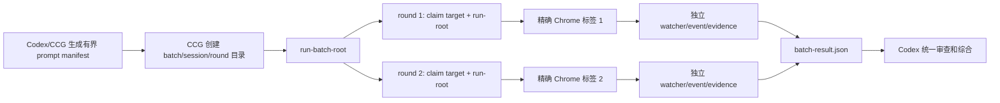

# 设计：GPT Pro 多窗口与跨 Codex 任务隔离

## 设计状态

- plan revision 4 已由 Claude Code/Opus 接受，Boss 已发起 `/ccg:execute`；当前进入分里程碑执行。
- Trellis 的 `prd.md`、本文与 `implement.md` 是任务权威；`.codex/ccg/plans/` 只保存执行编排。
- Boss 已确认每个 Codex 任务并发 `3`、每用户全局硬上限 `6`；M1 可按已接受计划执行，M2/M3 仍受前一里程碑验收门约束。

## 最小方案

复用现有 V2 的单轮 `send`、watcher、RootWait、幂等 reservation、证据目录与精确 URL 恢复，只增加三项能力：

1. `send`/`run-root` 接收完整 `TargetBinding` 与精确 `CodexThreadId`；
2. 新增一个本地 `run-batch-root` 编排命令，在一个 Codex 根调用中并发启动多个既有单轮流程并等待全部终态；
3. 把固定全局 UI mutex 改为按精确目标派生的 mutex，并给目标归属与 CCG 汇总写入增加原子保护。

不增加通用调度框架、数据库、后台服务、新依赖或模型侧轮询。

## 数据流



## 任务与页面归属

### 身份

- 任务身份：严格 UUID `CodexThreadId`。
- 临时标签身份：`browserId/profileId/tabId/sessionKey`。
- 稳定会话身份：`profileId + canonical conversation URL`。
- 每个 round 继续保存完整 `browserId/profileId/profileLabel/tabId/sessionKey/origin/url`、prompt/response hash、idempotency key、watcher id 与 evidence directory。

### 原子目标声明

复用现有 LocalAppData 文件式 `CreateNew` 模式，不引入中央数据库：

- 首次发送前，按完整临时标签身份派生 key，原子创建 target claim；
- 首页跳转得到 canonical URL 后，在同一 evidence 锁内补充稳定 `profileId + URL` 归属；
- claim 绑定 `CodexThreadId`、round、evidence directory 与当前 target binding；
- 同一线程、同一 round、同一 evidence 可恢复观察；不同线程不得接管；
- claim 不用 TTL 自动过期，也不能因进程死亡授权重发。损坏或孤儿 claim 只允许诊断后显式处理。

这样避免把租约超时误当成“可以再次点击”的依据。

## 锁与并发

锁不跨层嵌套持有：

1. **target claim**：短暂原子创建/更新，只决定归属；
2. **per-target UI mutex**：名称由完整 target binding 的 SHA-256 派生，只覆盖一次 DOM 探测、fill、回读与 click；
3. **per-evidence lock**：沿用 `.chatgpt-pro-sidebar.lock`，保护该 round 状态；
4. **task evidence lock**：保护 CCG `evidence.json` 的原子读改写。

不同标签可并行；同一标签冲突必须在点击前返回 `AgentBrowserTargetClaimConflict` 或 `ConcurrentUiOperation`。未知或不完整目标继续失败关闭，不能降级到“第一个标签”。

## 页面获取与恢复

- 优先使用该 `CodexThreadId` 已登记且仍精确匹配的页面。
- 页面不足时，只在 Boss 已批准且已连接的 Chrome profile 中 `open https://chatgpt.com/ --background`，等待标签身份和 DOM 就绪后再声明；不启动 Chrome、不登录、不切账号。
- 已有 canonical URL 的目标关闭或 Chrome 重启后，只能在同 profile 后台重开该 exact URL，再更新临时 binding。
- 首页尚未取得 canonical URL、同 URL 多候选、profile 多 browser、登录/挑战页或绑定漂移时失败关闭。
- 观察和恢复不请求焦点；实际 composer 输入仍沿用 V2 的最小焦点合同和恢复验证。

## 批次接口

新增 `run-batch-root`，输入一个本地 JSON manifest：

```json
{
  "schemaVersion": 1,
  "codexThreadId": "<uuid>",
  "maxConcurrency": 3,
  "rounds": [
    {
      "roundId": "analysis-a",
      "promptPath": "<absolute path>",
      "evidenceDirectory": "<absolute path>",
      "idempotencyKey": "<opaque unique key>"
    }
  ]
}
```

本地命令为每项声明不同目标，调用既有 `run-root`，在当前工具调用内等待终态。脚本不理解或拆分自然语言。

结果写入 `batch-result.json`，至少包含：batch/thread identity、每项 terminal status、target binding、conversation URL、prompt/response/evidence hashes、watcher id、evidence path、错误类别与 `submissionAcknowledged`。只要一项不是 `completed`，批次不得报告全成功；成功项仍保留供 Codex 审查。默认 batch timeout 为 `7200` 秒，可由 manifest 显式收窄或放宽；从未取得槽位的项目使用独立状态 `queued-timeout`，并记录 `errorCategory=ConcurrencySlotTimeout`、`submissionAcknowledged=false`，不得混同已发送失败或 `send-uncertain`。

## CCG 并发安全

- session 目录使用 UUID 或原子 `mkdir` 分配，删除“先 exists 再创建”的竞态。
- session/round `status.json` 使用临时文件写完后原子替换。
- `append_gptpro_evidence` 在任务级锁内读取、按 `task/thread/session/round` 去重、写临时文件并原子替换，避免并发导入丢项。
- importer 继续验证 exact thread、evidence directory、target binding、URL、prompt/response hash、watcher 与 acknowledgement；不同任务的证据不可交叉导入。

## 兼容与回退

- 保留现有单轮命令；未提供 batch manifest 时行为不变。
- 单标签自动选择只在候选唯一时继续有效；多标签未绑定仍报 `AgentBrowserTargetAmbiguous`。
- 不增加 UIA、侧边浏览器、CDP、Playwright、Selenium 或私有 API fallback。
- 变更按 adapter/watcher、CCG 源与 Harness 快照分层提交；回退不删除 evidence、target claim、canonical URL 或幂等 reservation。

## 并发策略（Boss 已确认）

每个 Codex 任务同时最多运行 `3` 个 round，每用户全局最多运行 `6` 个。单一 batch 可包含超过 3 项，但只在本地排队；全局第 7 项及以后同样等待可用槽位。槽位等待不打开页面、不写 composer、不点击发送；超过 batch timeout 返回 `ConcurrencySlotTimeout`，不偷偷扩大并发。

全局 `6` 槽位使用 LocalAppData 下固定六个 `CreateNew` slot claim，并由一个只在“计数并占位/释放”期间持有的短时全局 capacity mutex 串行更新；每个 claim 记录 `CodexThreadId`、round、evidence directory、watcher id、owner PID 与进程启动时间。进程死亡本身不释放槽位、更不授权发送：durable state 能证明从未越过 click 边界或已经 terminal 时才原子释放；已发送或 `send-uncertain` 的孤儿项先按 exact target/URL 进入只观察恢复，确认 terminal 后释放。无法证明终态时保留隔离槽位并返回 `ConcurrencySlotRecoveryRequired`，等待显式诊断；幂等 reservation 与 target claim 始终保留。

槽位管理只增加两个窄入口：一个只读列表命令输出脱敏后的 slot identity、owner 与 durable phase；一个显式诊断释放命令是唯一的人工释放路径。释放命令必须在 capacity mutex 内复核 durable state，且仅接受“pre-click 未发送”或“已经 terminal”两类证明；否则保持槽位并返回 `ConcurrencySlotRecoveryRequired`。释放不得删除幂等 reservation 或 target claim，也不得重新授权 click。

ChatGPT 在 click 前明确限流时返回 pre-send terminal failure；click 已发生或动作边界不确定时写 `send-uncertain`。两种情况都不自动重发，也不通过新增标签绕过站点限制。

`3/6` 是 Boss 的产品决定，不宣称为 ChatGPT 官方上限。官方没有公布 ChatGPT 网页多窗口固定并发数，agent-browser 也只确认支持并行 session 而未给固定上限。因此 Antigravity 给出的具体内存和站点阈值不作为事实，Grok 的 `verification_outcome=unresolved` 也不作为批准证据。

## Provider 综合

- 本地代码审计：固定全局 UI mutex、发送状态缺少 thread identity、调用方无法传完整 target binding、CCG 汇总写入竞态是四个共同根因。
- Grok：支持原子 claim、并发文件写保护和保守上限，但官方 ChatGPT 多标签合同未验证；其证据状态为 `unresolved`，仅作线索。
- Antigravity：支持 `run-batch-root`、per-target mutex、thread-bound state、原子 evidence 汇总；拒绝其未获官方支持的具体资源与限流数字。
- Claude Code/Opus：认可最小增量架构并独立确认 CCG session 分配与 task-level evidence 写入竞态；要求 Boss 决定并发数、增加饱和/限流验收、拆分三个验收里程碑，并把被快照排除的 adapter/bridge 关键行作为 task-local review handoff 后重审。

## 安全边界

- prompt 继续通过参数或文件路径传递，不拼 shell；日志不输出 prompt、Cookie、Token、浏览历史或认证状态。
- 发送动作前必须同时通过 thread ownership、完整 target binding、幂等 reservation、baseline 与 composer 回读校验。
- click 后的任何不确定仍进入 `send-uncertain`，永不自动重发。
- 同一 Chrome user-data-dir 不由多个浏览器实例共享；本方案默认复用当前已连接 profile 中的多个标签，不复制 profile。
