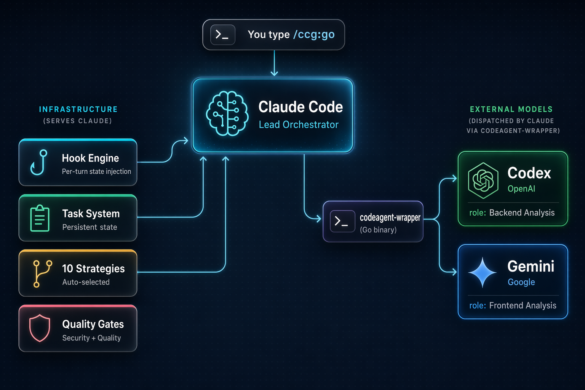

# CCG - Claude + Codex + Gemini Multi-Model Collaboration

<div align="center">


[](https://github.com/jed-zed/ccg-gptpro-worflow)
[](https://opensource.org/licenses/MIT)
[](https://github.com/jed-zed/ccg-gptpro-worflow/actions/workflows/ci.yml)
[](https://claude.ai/code)
[](https://nodejs.org/)
[](https://deepwiki.com/fengshao1227/ccg-workflow)

[简体中文](./README.zh-CN.md) | English

</div>

> This is the personal `jed-zed` distribution used by
> [`trellis-ccg-harness`](https://github.com/jed-zed/trellis-ccg-harness).
> It preserves upstream attribution while making the personal repository,
> pinned source manifest, and transactional Harness updater authoritative.

## ♥️ Sponsor

[](https://gammaremover.com/)

[Gamma Remover](https://gammaremover.com/) — Free browser-local Gamma watermark remover for PDF & PPTX. No signup, instant results, 100% private. Your files never leave your device.

---

[](https://share.302.ai/oUDqQ6)

[302.AI](https://share.302.ai/oUDqQ6) is a pay-as-you-go enterprise AI resource hub that offers the latest and most comprehensive AI models and APIs on the market, along with a variety of ready-to-use online AI applications.

---

## What is CCG?

**CCG is a workflow engine for Claude Code.** It turns Claude into a multi-model orchestrator — Claude stays in control while dispatching specialized work to Codex (OpenAI), Gemini (Google), and Grok (xAI) through a Go binary bridge.

One command. Describe what you want. The engine handles the rest.

```bash
npx ccg-workflow    # Install in 60 seconds
```

## Architecture

<div align="center">

</div>

**Claude Code** is the lead orchestrator. It analyzes your intent, selects a strategy, and manages the entire workflow. The **Hook Engine** injects state every turn so Claude never loses context — even after compaction. The **codeagent-wrapper** (a compiled Go binary) bridges Claude to external models for parallel analysis and review.

## Grok External Intelligence

Grok now has two deliberately separate roles:

- **Generic coding backend:** `--backend grok` can draft or review code through `codeagent-wrapper` like the other model backends.
- **External intelligence layer:** the official Grok Build CLI runs in a short-lived, read-only ACP session to collect current Web evidence and source-backed X-domain evidence. Codex decides when to invoke it and remains the final planner, editor, and verifier.

External intelligence is opt-in. `ccg init --intelligence` records consent but never logs in or sends a paid prompt; `--no-intelligence` keeps it disabled. Before opting in, assume that a focused snapshot of the selected task files, lockfiles, plan/diff summaries, and query may be sent to xAI. Secrets, credentials, `.git`, dependency trees, caches, links/reparse escapes, and `.ccgignore` paths are excluded. Model and search use may consume account quota or incur API charges.

```bash
ccg grok login                  # Official browser OAuth in a dedicated private GROK_HOME
ccg doctor --grok               # Local-only checks; no model prompt
ccg doctor --grok-live          # Explicit bounded paid Web/X smoke

/ccg:grok-intel <task> --mode discover|contract|incident|landscape [--official-domain vendor.example]
/ccg:grok-verify <task> --diff <bounded-diff-file>
```

Automatic routing covers planning, execution, review, Team, Spec, GPT Pro, and externally relevant quality gates. Hard triggers include current APIs/SDKs, dependency upgrades, incidents, CVEs, cloud/database versions, regulations, and deprecations; Codex may also make an explicit semantic decision. Local-only refactors and Git utilities remain offline by default. Verification requires a non-empty bounded diff, and decisions are re-evaluated against the complete Git worktree state plus task phase, plan, target, dependency, and diff digests. A required gate fails closed with no fallback to the legacy `grok-search` MCP or another provider.

`x_search_policy` supports `required`, `preferred`, and `disabled`. Incident mode may elevate `preferred`; `disabled` is never elevated, and X-only material is discovery evidence rather than an independent blocker. Official domains come only from an explicit target or trusted package/repository metadata; unknown targets stay `official_unknown`. Current Grok ACP may also emit native `XSearch` events without source URLs: CCG records those as advisory discovery only, while source-backed X evidence must come from a correlated `WebSearch site:x.com/site:twitter.com` result. Deep research is disabled by default; when enabled with a configured model, that exact model is validated, executed, fingerprinted, and recorded in evidence and the manifest.

Validated evidence is local-only by default:

```text
.codex/ccg/intelligence/<evidence-id>/
├── manifest.json
├── evidence.json        # Machine-readable source of truth
├── report.md
└── raw-stream.jsonl     # Redacted audit stream

.ccg/tasks/<task-id>/
├── evidence.json        # Canonical bounded task item
└── task.json            # intelligence pointer + hashes
```

Cache keys bind the task, mode, model/CLI/policy versions, the complete tracked diff and untracked-file contents, plan, dependencies, official-domain policy, and verification diff. Automatic routes always delegate reuse to the versioned manual cache, which revalidates every manifest member plus evidence/model provenance before reuse; `--force-refresh` always runs a fresh collection and replaces the same-key entry only after success. Retention and bundle caps use `retention_days`, `exported_retention_days`, and `max_bundle_bytes`; export requires `--export <directory>` and never happens automatically. A required blocked route can be waived only by the user with `ccg route waive --state-file <state-file> --reason "<user reason>"`; this records `actor=user` and a timestamp in route state, never mutates evidence, never claims verification passed, and requires downstream bridges to omit external-intelligence evidence flags while retaining the waiver in ordinary routing evidence.

On Windows, the dedicated credential and run roots are protected with owner-only ACLs and reject junction/reparse traversal. Local diagnostics snapshot and restore volatile credential state, and doctor runs purge historical sessions, logs, memtrace, and active-session indexes while preserving browser login, pinned config, and model metadata. Browser OAuth is the normal desktop path; the manual GitHub Actions live smoke uses an environment-approved `XAI_API_KEY`. Junction tests can be skipped by Windows itself when the runner lacks link-creation privilege, but production paths still fail closed on observed links/reparse points.

## How It Works

```
You: /ccg:go add JWT authentication to this API

CCG Engine:
  1. Reads project context (git status, tech stack, file structure)
  2. Classifies: feature / L complexity / backend / high risk
  3. Selects strategy: full-collaborate
  4. Creates .ccg/tasks/add-jwt-auth/task.json
  5. Launches dual-model analysis (Codex + Gemini in parallel)
  6. Produces plan → HARD STOP for your approval
  7. Spawns Agent Teams Builders for parallel implementation
  8. Runs quality gates + dual-model cross-review
  9. Reports results

Every turn, a hook injects:
  <ccg-state>
  Task: add-jwt-auth (in_progress)
  Strategy: full-collaborate
  Phase: 4-implementation
  </ccg-state>
```

## 10 Built-in Strategies

The engine auto-selects the right strategy based on task type and complexity:

| Strategy | When | External Models | Agent Teams |
|----------|------|:---:|:---:|
| `direct-fix` | Simple bug, single file | — | — |
| `quick-implement` | Small feature, clear scope | — | — |
| `guided-develop` | Medium feature, needs planning | Single | — |
| `full-collaborate` | Complex feature, multi-module | Dual parallel | ✓ |
| `debug-investigate` | Complex bug, unknown cause | Dual diagnosis | — |
| `refactor-safely` | Code restructuring | Dual review | — |
| `deep-research` | Technical research | Dual exploration | — |
| `optimize-measure` | Performance optimization | Optional | — |
| `review-audit` | Code review | Dual cross-review | — |
| `git-action` | commit, rollback, branches | — | — |

Simple tasks run fast with zero overhead. Complex tasks get the full engine.

## Core Features

### Hook Engine — Never Lose Context

4 JavaScript hooks inject state into every Claude Code session:

| Hook | Event | What it does |
|------|-------|-------------|
| `workflow-state.js` | Every turn | Injects current task state as breadcrumb |
| `session-start.js` | Session start/compact | Re-injects full project context |
| `subagent-context.js` | Agent/Bash spawn | Injects spec directly into subagent prompts |
| `skill-router.js` | Every turn | Auto-injects domain knowledge by keyword |

Context survives compaction. Sub-agents born with spec in their prompt. Zero state loss.

### Task System — Persistent Lifecycle

Medium+ complexity tasks get a persistent directory:

```
.ccg/tasks/add-jwt-auth/
├── task.json         # Status, strategy, phase, gate
├── requirements.md   # Enhanced requirements
├── plan.md           # Approved implementation plan
├── context.jsonl     # Spec files for sub-agent injection
├── review.md         # Review results
└── research/         # Persisted research findings
```

### Quality Gates — Built-in Security & Quality

| Gate | Trigger |
|------|---------|
| `/ccg:verify-security` | New modules, security changes |
| `/ccg:verify-quality` | Changes > 30 lines |
| `/ccg:verify-change` | Doc sync check |
| `/ccg:verify-module` | Module structure check |
| `/ccg:gen-docs` | Auto-generate README + DESIGN |

### 100+ Domain Knowledge Files

When your message mentions security, caching, RAG, Kubernetes, etc., the relevant knowledge file is auto-injected. 10 domains, 61 files:

`Security` · `Architecture` · `DevOps` · `AI/MLOps` · `Development` · `Frontend Design` · `Infrastructure` · `Mobile` · `Data Engineering` · `Orchestration`

## Commands

### Core (v3.3 default: 17 commands)

| Command | Description |
|---------|-------------|
| `/ccg:go` | **Smart entry** — describe what you want, engine handles the rest |
| `/ccg:commit` | Smart conventional commit |
| `/ccg:rollback` | Interactive rollback |
| `/ccg:clean-branches` | Clean merged branches |
| `/ccg:worktree` | Worktree management |
| `/ccg:init` | Initialize project CLAUDE.md |
| `/ccg:context` | Project context management |

### External Evidence

| Command | Description |
|---------|-------------|
| `/ccg:grok-intel` | Collect validated current Web/X evidence through isolated Grok ACP |
| `/ccg:grok-verify` | Verify a plan, diff, target, and dependencies against current facts |
| `/ccg:gptpro-plan` | Automated GPT Pro sidebar planning evidence after required Grok routing |
| `/ccg:gptpro-exc` | Automated GPT Pro sidebar execution-route review |
| `/ccg:gptpro-review` | Automated GPT Pro sidebar final review with canonical Grok provenance |

### OpenSpec Integration

| Command | Description |
|---------|-------------|
| `/ccg:spec-init` | Initialize OPSX environment |
| `/ccg:spec-research` | Requirements → constraints |
| `/ccg:spec-plan` | Constraints → zero-decision plan |
| `/ccg:spec-impl` | Execute plan + archive |
| `/ccg:spec-review` | Dual-model cross-review |

### Legacy Mode (18 additional commands)

Includes `/ccg:workflow`, `/ccg:plan`, `/ccg:execute`, `/ccg:frontend`, `/ccg:backend`, `/ccg:analyze`, `/ccg:debug`, `/ccg:optimize`, `/ccg:test`, `/ccg:review`, `/ccg:team`, and more.

## Quick Start

```bash
# From a reviewed, full 40-character personal commit
corepack enable
pnpm install --frozen-lockfile
pnpm build
node bin/ccg.mjs init
```

Requires **Node.js 20+** and **Claude Code CLI**. Codex CLI, Gemini CLI, and Grok CLI are optional (enable multi-model features).

If you hand this repository URL to an AI agent, have it follow
[`AI_INSTALL.md`](./AI_INSTALL.md). The repository URL is not installation
approval. After CCG is installed, `ccg addons` or `ccg addons --json` shows the
recommended Ponytail, Caveman, grill-me, Context7, Playwright, official
DeepWiki, and Exa companions without installing anything; the default is always
skip. Approved auxiliary MCPs are configured separately with `ccg config mcp`.

## CLI Commands

```bash
node bin/ccg.mjs                          # Interactive menu
node bin/ccg.mjs init                     # 4-step install wizard
node bin/ccg.mjs addons                   # Read-only companion add-on catalog
node bin/ccg.mjs addons --json            # Machine-readable catalog for AI agents
node bin/ccg.mjs doctor                   # Environment health check
node bin/ccg.mjs doctor --platform codex  # Explicit Codex ownership/version health check
node bin/ccg.mjs status                   # Installation overview
node bin/ccg.mjs codex-mode install       # Install Codex-Led mode
node bin/ccg.mjs codex-mode uninstall     # Uninstall Codex-Led mode
node bin/ccg.mjs codex-mode recover       # Recover an interrupted Codex transaction
node bin/ccg.mjs routing list              # Show four top-level role providers
node bin/ccg.mjs routing set frontend claude # Change one role only
node bin/ccg.mjs uninstall                # Uninstall CCG
node bin/ccg.mjs config mcp               # Configure approved MCPs
node bin/ccg.mjs diagnose-mcp             # Static MCP diagnosis
node bin/ccg.mjs diagnose-mcp --smoke     # Opt-in bounded stdio handshake
node bin/ccg.mjs grok login               # Direct official Grok browser login
node bin/ccg.mjs doctor --grok            # Non-paid Grok contract doctor
node bin/ccg.mjs doctor --grok-live       # Explicit paid Web/X smoke
```

Codex mode stores routing for `frontend`, `backend`, `search`, and
`product-manager`. The first three may use any provider already registered by
`codeagent-wrapper`: `codex`, `gemini`, `claude`, `antigravity`, `grok`, or `pi`;
product-manager remains limited by its read-only contract and project allowlist.
Frontend or backend work automatically adds required search evidence and
evaluates the product-manager authorization gate; the Provider call still
requires explicit per-call approval. Codex remains the final writer and verifier.

## Configuration

```
~/.claude/
├── commands/ccg/          # Slash commands
├── hooks/ccg/             # Hook scripts (5 files)
├── skills/ccg/            # Quality gates + 100+ domain knowledge
├── rules/                 # Auto-trigger rules
├── .ccg/
│   ├── config.toml        # Model routing, MCP, performance
│   ├── engine/            # 10 strategy files + model router
│   └── prompts/           # Expert prompts (codex/gemini/claude)
└── bin/codeagent-wrapper  # Multi-model bridge (Go binary)
```

### Environment Variables

Set in `~/.claude/settings.json` under `"env"`:

| Variable | Default | Description |
|----------|---------|-------------|
| `CODEX_TIMEOUT` | `7200` | Wrapper timeout (seconds) |
| `CODEAGENT_POST_MESSAGE_DELAY` | `5` | Post-completion delay |
| `CLAUDE_CODE_EXPERIMENTAL_AGENT_TEAMS` | unset | Set `1` for parallel Agent Teams |
| `XAI_API_KEY` | unset | Explicit API-key auth for approved headless/CI Grok intelligence runs |

## Security and Ownership

- The wrapper binary is downloaded only from the personal release and its
  pinned SHA-256 is verified before chmod or execution.
- Core executable npm/Git dependencies remain exact-version or exact-commit
  entries in `third-party-sources.json`. The five optional add-on packages use
  an explicit `latest` channel; no numeric add-on version is stored in the repo.
- MCP secrets are stored in owner-only files and loaded by a local launcher, so
  they are not placed in process arguments or mirrored into other runtimes.
  MCP children receive a minimal allowlisted base environment plus only the
  variables approved for that server.
- MCP entries are managed per target (`Claude`, `Codex`, and `Gemini`) in a
  strict ownership ledger. Same-name user entries require explicit adoption,
  retain their first exact structured baseline, and are restored on uninstall;
  post-install user edits are preserved and block mutation.
- Official remote MCP endpoints are exact HTTPS allowlist entries. Streamable
  HTTP is written in each host's native shape (`type=http`, `url`, or
  `httpUrl`), and URL credentials, arbitrary queries, and legacy DeepWiki SSE
  are rejected.
- Exa's hosted free tier does not require a key. The CLI links
  `https://dashboard.exa.ai/api-keys` for higher limits and keeps optional local
  keys in the owner-only secret launcher.
- Codex mode uses strict digest-bound ownership and transaction manifests.
  Install and uninstall reject linked/junction path components, preserve
  unrelated user files, and fail closed on malformed or modified state. A
  process crash leaves a durable journal; run `ccg codex-mode recover` before
  another lifecycle operation.
- Wrapper acquisition is fail-closed: a download, digest, version, or platform
  failure makes initialization fail until the pinned binary verifies.
- `diagnose-mcp --smoke` is explicit, stdio-only, time/output bounded, redacted,
  runs only after static validation succeeds, and terminates the complete child
  process tree. CLI failures always return a nonzero exit status.

## Update / Rollback / Uninstall

The built-in public npm updater is disabled. From the
`trellis-ccg-harness` root, use an explicit personal commit:

```bash
pnpm harness:update -- --ccg-commit <40-character-commit>
pnpm harness:doctor
pnpm harness:rollback
pnpm harness:uninstall
```

## Credits

- [fengshao1227/ccg-workflow](https://github.com/fengshao1227/ccg-workflow) — upstream CCG project
- [cexll/myclaude](https://github.com/cexll/myclaude) — codeagent-wrapper inspiration
- [UfoMiao/zcf](https://github.com/UfoMiao/zcf) — Git tools reference
- [mindfold-ai/Trellis](https://github.com/mindfold-ai/Trellis) — Hook-based workflow state patterns
- [ace-tool](https://linux.do/t/topic/1344562) — MCP code retrieval

## Upstream Contributors

<!-- readme: contributors -start -->
<table>
<tr>
    <td align="center"><a href="https://github.com/fengshao1227"><br /><sub><b>fengshao1227</b></sub></a></td>
    <td align="center"><a href="https://github.com/SXP-Simon"><br /><sub><b>SXP-Simon</b></sub></a></td>
    <td align="center"><a href="https://github.com/RebornQ"><br /><sub><b>RebornQ</b></sub></a></td>
    <td align="center"><a href="https://github.com/Sakuranda"><br /><sub><b>Sakuranda</b></sub></a></td>
    <td align="center"><a href="https://github.com/Mriris"><br /><sub><b>Mriris</b></sub></a></td>
    <td align="center"><a href="https://github.com/23q3"><br /><sub><b>23q3</b></sub></a></td>
    <td align="center"><a href="https://github.com/MrNine-666"><br /><sub><b>MrNine-666</b></sub></a></td>
</tr>
<tr>
    <td align="center"><a href="https://github.com/GGzili"><br /><sub><b>GGzili</b></sub></a></td>
</tr>
</table>
<!-- readme: contributors -end -->

## Support

- **Personal fork issues**: [GitHub Issues](https://github.com/jed-zed/ccg-gptpro-worflow/issues)
- **Upstream community**: [Linux.do](https://linux.do)

## License

MIT

---

v3.4.5 | [Issues](https://github.com/jed-zed/ccg-gptpro-worflow/issues) | [Contributing](./CONTRIBUTING.md)
