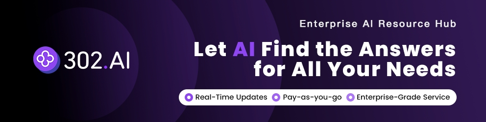

# CCG - Claude + Codex + Gemini 多模型协作

<div align="center">


[](https://github.com/fengshao1227/ccg-workflow)
[](https://www.npmjs.com/package/ccg-workflow)
[](https://www.npmjs.com/package/ccg-workflow)
[](https://opensource.org/licenses/MIT)
[](https://github.com/fengshao1227/ccg-workflow/actions/workflows/ci.yml)
[](https://codecov.io/gh/fengshao1227/ccg-workflow)
[](https://claude.ai/code)
[](https://nodejs.org/)
[](https://x.com/CCG_Workflow)

[](https://ccg.fengshao1227.com/)
[](https://deepwiki.com/fengshao1227/ccg-workflow)

[简体中文](./README.zh-CN.md) | [English](./README.md) | [**完整文档**](https://ccg.fengshao1227.com/)

</div>

## ♥️ Sponsor

[](https://gammaremover.com/)

[Gamma Remover](https://gammaremover.com/) — 免费浏览器本地 Gamma 水印去除工具。支持 PDF 和 PPTX，无需注册，即时出结果，100% 隐私，文件不离开你的设备。

---

[](https://share.302.ai/oUDqQ6)

[302.AI](https://share.302.ai/oUDqQ6) is a pay-as-you-go enterprise AI resource hub that offers the latest and most comprehensive AI models and APIs on the market, along with a variety of ready-to-use online AI applications.

---

## CCG 是什么？

**CCG 是 Claude Code 的工作流引擎。** 它让 Claude 变成多模型编排器 —— Claude 保持主控地位，通过 Go 编译的 codeagent-wrapper 将专业任务分发给 Codex（OpenAI）、Gemini（Google）和 Grok（xAI）。

一条命令，描述你要做什么，引擎自动处理一切。

```bash
npx ccg-workflow    # 60 秒安装
```

## 架构

<div align="center">

</div>

**Claude Code** 是主控编排器。它分析你的意图、选择策略、管理整个工作流。**Hook 引擎**每轮注入状态，确保 Claude 永不丢失上下文 —— 即使上下文被压缩。**codeagent-wrapper**（编译的 Go 二进制）作为桥梁，将 Claude 连接到外部模型进行并行分析和审查。

## Grok 外部情报层

Grok 现在有两个刻意隔离的定位：

- **通用编码后端**：`--backend grok` 与其他模型后端一样，可通过 `codeagent-wrapper` 起草或审查代码。
- **外部情报层**：官方 Grok Build CLI 在短生命周期、只读的 ACP 会话中收集最新 Web 证据和有来源的 X 域证据。Codex 自主判断何时启用，并始终保留最终规划、编辑和验收权。

外部情报必须明确选择加入。`ccg init --intelligence` 只记录同意，不登录、不发送付费 prompt；`--no-intelligence` 会保持关闭。选择加入前请知悉：CCG 可能向 xAI 发送经过筛选的任务文件、锁文件、计划/diff 摘要和查询文本。秘密、凭据、`.git`、依赖目录、缓存、链接/重解析逃逸路径及 `.ccgignore` 路径会被排除。模型与搜索调用可能消耗账户额度或产生 API 费用。

```bash
ccg grok login                  # 在独立私有 GROK_HOME 中进行官方浏览器 OAuth
ccg doctor --grok               # 仅本地检查，不发送模型 prompt
ccg doctor --grok-live          # 显式、有限额的付费 Web/X 冒烟

/ccg:grok-intel <任务> --mode discover|contract|incident|landscape
/ccg:grok-verify [计划或 diff]
```

自动路由覆盖规划、执行、审查、Team、Spec、GPT Pro，以及涉及外部事实的质量门禁。API/SDK、依赖升级、线上事故、CVE、云/数据库版本、法规和弃用属于硬触发；Codex 也可给出带理由的语义判断。本地重构和纯 Git 工具默认不联网。任务阶段、计划、目标、依赖或 diff 摘要变化时会重新判断。必需门禁失败会关闭式阻断，不会回退到旧 `grok-search` MCP 或其他提供方。

`x_search_policy` 可设为 `required`、`preferred`、`disabled`。事故模式可把 `preferred` 提升为必需；`disabled` 永不提升，且仅来自 X 的材料只能作为发现线索，不能独立形成阻塞结论。当前 Grok ACP 还可能发出不含来源 URL 的原生 `XSearch` 事件：CCG 只把它记录为发现型建议，真正有来源的 X 证据必须来自相关联的 `WebSearch site:x.com/site:twitter.com` 结果。Deep research 默认关闭；未来即使启用，也只是 leader 可见的建议证据，不能单独满足必需门禁。

验证后的证据默认只保存在本地：

```text
.codex/ccg/intelligence/<evidence-id>/
├── manifest.json
├── evidence.json        # 机器可读的事实源
├── report.md
└── raw-stream.jsonl     # 已脱敏审计流

.ccg/tasks/<task-id>/
├── evidence.json        # 规范化、有限大小的任务证据项
└── task.json            # intelligence 指针与哈希
```

缓存键绑定任务、模式、计划、目标、依赖、diff 和阶段；`--force-refresh` 可跳过缓存。本地证据默认保留 7 天，显式导出的脱敏包保留 30 天。只有传入 `--export <目录>` 才会导出，系统绝不自动导出。必需门禁只能由用户明确授权豁免，并记录理由和时间。

Windows 上的凭据目录和运行目录使用仅所有者 ACL，并拒绝 junction/重解析路径穿越。桌面默认使用浏览器 OAuth；手动 GitHub Actions live smoke 通过受 environment 审批的 `XAI_API_KEY` 运行。若 Windows 运行器没有创建链接的权限，junction 测试会被系统跳过，但生产路径一旦观察到链接或重解析点仍会关闭式拒绝。

## 工作流程

```
你: /ccg:go 给这个 API 加 JWT 认证

CCG 引擎:
  1. 读取项目上下文（git 状态、技术栈、文件结构）
  2. 分类：功能 / L 复杂度 / 后端 / 高风险
  3. 选择策略：full-collaborate（全协作）
  4. 创建 .ccg/tasks/add-jwt-auth/task.json
  5. 启动双模型并行分析（Codex + Gemini）
  6. 生成计划 → 硬停等你审批
  7. 派生 Agent Teams Builder 并行实施
  8. 运行质量关卡 + 双模型交叉审查
  9. 报告结果

每一轮，Hook 自动注入：
  <ccg-state>
  任务: add-jwt-auth (进行中)
  策略: full-collaborate
  阶段: 4-实施
  </ccg-state>
```

## 10 种内置策略

引擎根据任务类型和复杂度自动选择最佳策略：

| 策略 | 适用场景 | 外部模型 | Agent Teams |
|------|---------|:---:|:---:|
| `direct-fix` | 简单 bug，单文件 | — | — |
| `quick-implement` | 小功能，范围明确 | — | — |
| `guided-develop` | 中等功能，需要规划 | 单模型 | — |
| `full-collaborate` | 复杂功能，跨模块 | 双模型并行 | ✓ |
| `debug-investigate` | 复杂 bug，原因未知 | 双模型诊断 | — |
| `refactor-safely` | 代码重构 | 双模型审查 | — |
| `deep-research` | 技术调研 | 双模型探索 | — |
| `optimize-measure` | 性能优化 | 可选 | — |
| `review-audit` | 代码审查 | 双模型交叉审查 | — |
| `git-action` | commit、rollback、分支 | — | — |

简单任务零开销快速执行。复杂任务调动全部引擎能力。

## 核心能力

### Hook 引擎 — 永不丢失上下文

4 个 JavaScript Hook 为每个 Claude Code 会话注入状态：

| Hook | 触发时机 | 作用 |
|------|---------|------|
| `workflow-state.js` | 每轮用户消息 | 注入当前任务状态面包屑 |
| `session-start.js` | 会话开始/压缩 | 重新注入完整项目上下文 |
| `subagent-context.js` | Agent/Bash 调用 | 将 spec 直接注入子 agent 的 prompt |
| `skill-router.js` | 每轮用户消息 | 按关键词自动注入域知识 |

上下文在压缩后自动恢复。子 agent 出生即带 spec。零状态丢失。

### 任务系统 — 持久化生命周期

中等及以上复杂度的任务获得持久化目录：

```
.ccg/tasks/add-jwt-auth/
├── task.json         # 状态、策略、阶段、门控
├── requirements.md   # 增强需求
├── plan.md           # 已审批的实施计划
├── context.jsonl     # 子 agent 注入的 spec 文件
├── review.md         # 审查结果
└── research/         # 持久化研究成果
```

### 质量关卡 — 内置安全与质量检查

| 关卡 | 触发条件 |
|------|---------|
| `/ccg:verify-security` | 新模块、安全相关变更 |
| `/ccg:verify-quality` | 变更超过 30 行 |
| `/ccg:verify-change` | 文档同步检查 |
| `/ccg:verify-module` | 模块结构检查 |
| `/ccg:gen-docs` | 自动生成 README + DESIGN |

### 100+ 域知识秘典

当你的消息提到安全、缓存、RAG、Kubernetes 等关键词时，对应的知识文件自动注入。10 大领域，61 个文件：

`安全` · `架构` · `DevOps` · `AI/MLOps` · `开发语言` · `前端设计` · `基础设施` · `移动端` · `数据工程` · `编排`

## 命令

### 核心命令（v3.3 默认安装 17 个）

| 命令 | 说明 |
|------|------|
| `/ccg:go` | **智能入口** — 描述你要做什么，引擎自动处理 |
| `/ccg:commit` | 智能 Conventional Commit |
| `/ccg:rollback` | 交互式回滚 |
| `/ccg:clean-branches` | 清理已合并分支 |
| `/ccg:worktree` | Worktree 管理 |
| `/ccg:init` | 初始化项目 CLAUDE.md |
| `/ccg:context` | 项目上下文管理 |

### 外部证据命令

| 命令 | 说明 |
|------|------|
| `/ccg:grok-intel` | 通过隔离的 Grok ACP 收集并验证最新 Web/X 证据 |
| `/ccg:grok-verify` | 根据最新事实核验计划、diff、目标和依赖 |
| `/ccg:gptpro-plan` | 必需 Grok 路由后，手动获取 GPT Pro 规划证据 |
| `/ccg:gptpro-exc` | 手动进行 GPT Pro 执行路线审查 |
| `/ccg:gptpro-review` | 使用规范 Grok 来源记录进行 GPT Pro 最终审查 |

### OpenSpec 集成

| 命令 | 说明 |
|------|------|
| `/ccg:spec-init` | 初始化 OPSX 环境 |
| `/ccg:spec-research` | 需求 → 约束集 |
| `/ccg:spec-plan` | 零决策可执行计划 |
| `/ccg:spec-impl` | 按规范实施 + 归档 |
| `/ccg:spec-review` | 双模型交叉审查 |

### Legacy 模式（额外 18 个命令）

包括 `/ccg:workflow`、`/ccg:plan`、`/ccg:execute`、`/ccg:frontend`、`/ccg:backend`、`/ccg:analyze`、`/ccg:debug`、`/ccg:optimize`、`/ccg:test`、`/ccg:review`、`/ccg:team` 等。

## 快速开始

```bash
# 安装（交互式 4 步向导）
npx ccg-workflow

# 或非交互式使用默认配置
npx ccg-workflow init --skip-prompt
```

需要 **Node.js 20+** 和 **Claude Code CLI**。Codex CLI、Gemini CLI 和 Grok CLI 为可选（启用多模型功能）。

## CLI 命令大全

```bash
npx ccg-workflow                          # 交互式菜单
npx ccg-workflow init                     # 4 步安装向导
npx ccg-workflow doctor                   # 环境健康检查
npx ccg-workflow status                   # 安装概况
npx ccg-workflow codex-mode install       # 安装 Codex 主导模式
npx ccg-workflow codex-mode uninstall     # 卸载 Codex 主导模式
npx ccg-workflow uninstall                # 卸载 CCG
npx ccg-workflow config mcp               # 配置 MCP Token
npx ccg-workflow diagnose-mcp             # 诊断 MCP 问题
ccg grok login                             # 直接进行官方 Grok 浏览器登录
ccg doctor --grok                          # 非付费 Grok 合约检查
ccg doctor --grok-live                     # 显式付费 Web/X 冒烟
```

## 配置

```
~/.claude/
├── commands/ccg/          # 斜杠命令
├── hooks/ccg/             # Hook 脚本（5 个文件）
├── skills/ccg/            # 质量关卡 + 100+ 域知识
├── rules/                 # 自动触发规则
├── .ccg/
│   ├── config.toml        # 模型路由、MCP、性能配置
│   ├── engine/            # 10 个策略文件 + 模型路由器
│   └── prompts/           # 专家提示词（codex/gemini/claude）
└── bin/codeagent-wrapper  # 多模型桥接（Go 二进制）
```

### 环境变量

在 `~/.claude/settings.json` 的 `"env"` 中设置：

| 变量 | 默认值 | 说明 |
|------|--------|------|
| `CODEX_TIMEOUT` | `7200` | Wrapper 超时（秒） |
| `CODEAGENT_POST_MESSAGE_DELAY` | `5` | 完成后延迟（秒） |
| `CLAUDE_CODE_EXPERIMENTAL_AGENT_TEAMS` | 未设置 | 设为 `1` 启用 Agent Teams 并行 |
| `XAI_API_KEY` | 未设置 | 经批准的无界面/CI Grok 情报运行所用显式 API Key |

## 更新 / 卸载

```bash
npx ccg-workflow@latest     # 更新到最新版
npx ccg-workflow doctor     # 更新后健康检查
npx ccg-workflow uninstall  # 彻底卸载
```

## 致谢

- [cexll/myclaude](https://github.com/cexll/myclaude) — codeagent-wrapper 灵感来源
- [UfoMiao/zcf](https://github.com/UfoMiao/zcf) — Git 工具参考
- [mindfold-ai/Trellis](https://github.com/mindfold-ai/Trellis) — Hook 状态注入模式
- [ace-tool](https://linux.do/t/topic/1344562) — MCP 代码检索

## 贡献者

<!-- readme: contributors -start -->
<table>
<tr>
    <td align="center"><a href="https://github.com/fengshao1227"><br /><sub><b>fengshao1227</b></sub></a></td>
    <td align="center"><a href="https://github.com/SXP-Simon"><br /><sub><b>SXP-Simon</b></sub></a></td>
    <td align="center"><a href="https://github.com/RebornQ"><br /><sub><b>RebornQ</b></sub></a></td>
    <td align="center"><a href="https://github.com/Sakuranda"><br /><sub><b>Sakuranda</b></sub></a></td>
    <td align="center"><a href="https://github.com/Mriris"><br /><sub><b>Mriris</b></sub></a></td>
    <td align="center"><a href="https://github.com/23q3"><br /><sub><b>23q3</b></sub></a></td>
    <td align="center"><a href="https://github.com/MrNine-666"><br /><sub><b>MrNine-666</b></sub></a></td>
</tr>
<tr>
    <td align="center"><a href="https://github.com/GGzili"><br /><sub><b>GGzili</b></sub></a></td>
</tr>
</table>
<!-- readme: contributors -end -->

## 联系

- **X (Twitter)**: [@CCG_Workflow](https://x.com/CCG_Workflow)
- **Email**: [fengshao1227@gmail.com](mailto:fengshao1227@gmail.com)
- **Issues**: [GitHub Issues](https://github.com/fengshao1227/ccg-workflow/issues)
- **社区**: [Linux.do](https://linux.do)

## Star 历史

[](https://www.star-history.com/#fengshao1227/ccg-workflow&type=timeline&legend=top-left)

## 许可证

MIT

---

v3.3.0 | [Issues](https://github.com/fengshao1227/ccg-workflow/issues) | [Contributing](./CONTRIBUTING.md)
