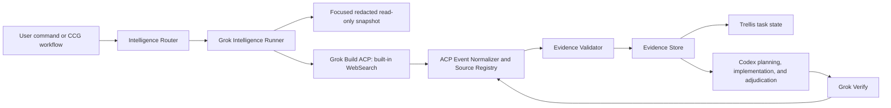

# Grok External Intelligence Orchestrator Design

**Status:** Approved design, corrected by the Windows runtime contract probe

**Date:** 2026-07-20

**Primary owner:** Codex orchestrator

**External intelligence provider:** Official Grok Build CLI

## 1. Summary

CCG will promote Grok from a generic fifth model backend into the harness's external intelligence layer. Grok will investigate the current external world before implementation and verify current external facts after implementation. Codex remains the final orchestrator, implementation owner, test runner, and adjudicator.

The first release will use the official Grok Build CLI through a short-lived ACP session (`grok agent stdio`). The one-shot `grok -p` path is excluded from the intelligence profile because the Windows contract probe showed that it can start disabled compatibility MCPs and does not expose a reliable evidence event contract. It will add two user-facing commands:

- `/ccg:grok-intel` for pre-implementation research;
- `/ccg:grok-verify` for post-implementation freshness and external-fact review.

The same intelligence decision and execution path will also be invoked automatically by the main CCG, Spec, Team, quality-gate, and GPT Pro workflows when the task depends on current external information. Users do not need to request a search explicitly.

## 2. Goals

- Use Grok's built-in WebSearch through the official Grok Build CLI, including source-backed X-domain queries. The probed CLI exposes no distinct X-search tool ID.
- Prove that a search occurred by validating CLI tool events, not by trusting prose.
- Convert search results into claim-level evidence that other CCG components can consume.
- Trigger external research automatically for time-sensitive and externally coupled tasks.
- Keep Grok read-only with respect to the real workspace while still allowing isolated reproduction scripts and experiments.
- Fail closed when a mandatory intelligence gate cannot produce valid evidence.
- Feed validated Grok evidence into Codex, Trellis, Gemini, Claude, and GPT Pro without changing their authority boundaries.
- Preserve the existing generic Grok coding backend for ordinary model routing.

## 3. Non-goals

- Grok will not replace Codex as the main orchestrator or implementation owner.
- The intelligence role will not write, commit, merge, push, or modify the real repository.
- The first release will not add a direct xAI Responses API execution path.
- The first release will not keep a shared, long-lived Grok ACP process or session pool.
- Required gates will not depend on deep multi-agent research; deep runs are advisory and expose leader-visible events only.
- The GPT Pro bridge will not automate ChatGPT login, submission, DOM access, or response extraction.
- Social posts, search summaries, and unverified community reports will not independently block a change.

## 4. Current State and Gap

The repository already contains a `grok` backend in `codeagent-wrapper`. It resolves the official `grok` executable, runs headless prompts with `streaming-json`, accepts a Grok model flag, and supports session resume. This remains a generic coding backend. The intelligence role is a separate ACP client because it must enforce search, validate the runtime source registry, deny permissions, and prove an empty MCP context.

The Windows contract probe installed the official CLI, completed direct browser OAuth in an ACL-restricted dedicated `GROK_HOME`, and validated the ACP event contract. The authoritative probe result is [Grok CLI contract on Windows](../../verification/grok-cli-contract-windows.md). Installation, direct login, non-paid capability diagnosis, and explicit paid live checks remain separate delivery surfaces.

## 5. Chosen Approach

CCG will add a dedicated, zero-third-party-dependency Node.js ACP client and Grok Intelligence Runner alongside the existing generic wrapper infrastructure.

Rejected alternatives:

1. **Prompt-only templates over the generic backend:** inexpensive to build, but cannot prove that search tools ran and cannot enforce evidence quality.
2. **One-shot `grok -p` transport:** rejected after the Windows probe showed disabled MCP startup attempts and no stable source-event contract for strict evidence.
3. **Direct xAI API integration:** offers deterministic server-side tool configuration, but would duplicate authentication and transport paths and would not satisfy the CLI-first requirement.

Each intelligence run owns one bounded ACP process. Shared persistent ACP sessions remain a future optimization.

## 6. Architecture



### 6.1 Intelligence Router

The router runs before every supported workflow and returns an auditable decision:

```json
{
  "enabled": true,
  "requirement": "required",
  "mode": "contract",
  "trigger": "dependency_upgrade",
  "reason": "The change depends on current SDK behavior and deprecation status",
  "evidence_id": "intel-20260720-001",
  "freshness": "fresh"
}
```

The router combines deterministic hard-trigger rules with Codex semantic judgment for ambiguous cases. An enabled or skipped decision must always include a reason.

### 6.2 Grok Intelligence Runner

The runner:

- invokes `grok agent stdio`, never one-shot `grok -p`;
- uses an exact environment and a dedicated private `GROK_HOME` containing the user's official browser login;
- disables background CLI updates for automated runs;
- initializes ACP with no filesystem or terminal capabilities, creates every session with `mcpServers: []`, and requires empty-MCP preflight notifications;
- rejects every ACP permission request and disables plan, memory, subagents, shell, edit, read, fetch, and non-search tools;
- applies an intelligence-specific system prompt and mode template;
- limits the tool surface to built-in WebSearch and runs against a validated neutral or focused snapshot directory;
- stores the raw, redacted event stream;
- accepts a URL only from the correlated ACP tool event's `rawOutput.action.sources`, never from assistant prose;
- returns normalized text, session metadata, search events, citations, errors, and usage metadata;
- retries transient failures in a new session at most twice.

The existing generic `--backend grok` behavior remains available and separate.

### 6.3 Isolation Boundary

Grok never receives write access to the real workspace. Trusted CCG code creates a focused, size-bounded snapshot containing only router-selected source, configuration, lockfile, and diff context. The snapshot excludes secrets, credentials, `.git`, dependency trees, caches, instruction/plugin surfaces, links and reparse escapes, and user-configured `.ccgignore` paths. It is data minimization, not the security boundary; the ACP client still advertises no filesystem or terminal capability.

Snapshot files are marked read-only where supported. Grok cannot write scripts, patches, or reproduction artifacts in the first release. Any future trusted reproduction must be implemented by CCG-side fixed code and re-reviewed as a separate capability.

### 6.4 Evidence Validator

The validator rejects essay-only output. A successful intelligence run must contain the required search tool events, valid source records, a schema-valid evidence package, and explicit claim-to-source links. It also applies source-tier and blocker policy.

### 6.5 Evidence Store and Trellis

Each run uses:

```text
.codex/ccg/intelligence/<task-id>/
├── manifest.json
├── evidence.json
├── report.md
└── raw-stream.jsonl
```

`evidence.json` is the machine-readable source of truth. `report.md` is generated from the validated JSON. `raw-stream.jsonl` exists only for audit and diagnosis. Trellis records the intelligence decision, validation state, artifact path, and digest instead of duplicating the entire evidence body.

## 7. Intelligence Modes

### 7.1 `discover`

Research current libraries, open-source foundations, official recommendations, maintenance health, releases, unresolved defects, alternatives, migration cost, and production feedback.

Web Search is required. Source-backed X-domain evidence may become required only when the configured policy permits it and current maintainer direction or ecosystem activity materially affects the decision.

### 7.2 `contract`

Verify third-party APIs, SDK behavior, deprecations, compatibility, cloud limits, database behavior, financial rules, regulations, standards, CVEs, and security advisories.

Web Search is required. Source-backed X-domain evidence may become required only when the configured policy permits it and the contract depends on a recent maintainer statement, rollout, or breaking-change report.

### 7.3 `incident`

Investigate current outages, newly released regressions, recent GitHub reports, status pages, certificates, DNS, CDN, regions, and maintainer workarounds.

Web Search is required. When the configured X policy is `preferred`, incident mode elevates it to required. An explicit `disabled` policy is never elevated.

### 7.4 `landscape`

Research competitors, product changes, user complaints, demand trends, pricing, business models, emerging projects, and market language.

Web Search is required. X evidence is preferred but not mandatory; landscape research must remain useful when no source-backed X result exists.

### 7.5 `verify`

Review a plan, applied diff, dependency changes, and tests against current external reality. Check current documentation, known defects, advisories, compatibility, deprecations, and realistic failure scenarios.

Web Search is required. X evidence follows the configured policy and is required for an incident/current rollout only when that policy permits elevation.

## 8. Commands and Configuration

### 8.1 Commands

```text
/ccg:grok-intel <task>
/ccg:grok-intel <task> --mode discover|contract|incident|landscape
/ccg:grok-intel <task> --depth normal|deep
/ccg:grok-intel <task> --force-refresh

/ccg:grok-verify [plan|diff|task]
/ccg:grok-verify [target] --force-refresh

/ccg:doctor --grok
```

When `--mode` is omitted, the router selects a mode. Manual and automatic invocation share the same runner and validator.

### 8.2 Configuration

```toml
[intelligence]
enabled = false
auto_route = false
provider = "grok-cli"
transport = "acp"
auth_mode = "browser_oauth"
legacy_search_provider = "grok-search-mcp"
allow_provider_fallback = false
default_model = "grok-4.5"
deep_research_model = ""
deep_research_enabled = false
live_checks_on_init = false
artifact_root = ".codex/ccg/intelligence"
max_retries = 2
max_bundle_bytes = 16777216
retention_days = 7
exported_retention_days = 30
cleanup_credential_artifacts = true
require_web_search = true
x_search_policy = "preferred"
```

Old configurations and non-interactive installs without `--intelligence` remain disabled. Interactive init presents a disclosure covering the focused task/snapshot sent, Web/X use, cost, artifacts, browser login, private credential home, and fail-closed behavior. `--no-intelligence` explicitly opts out. Init performs no login and no paid live smoke.

`x_search_policy` is `required`, `preferred`, or `disabled`. Incident mode may elevate `preferred` to required; landscape leaves it preferred; `disabled` is never elevated. X-only evidence can never create a blocker because X is a discovery radar, not independent final authority.

The unavailable deep model is represented by an empty model name and remains disabled. If a future deep model is enabled and available, its manifest must record `evidence_visibility = "leader_only"`; observed leader events must never be presented as total server-side tool usage. Deep output is advisory and cannot satisfy a required gate by itself.

## 9. Automatic Routing

### 9.1 Hard Triggers

After the user opts in, Grok is mandatory for:

- external APIs, SDKs, protocols, or third-party services;
- dependency additions, replacements, or upgrades;
- CVEs, security advisories, authentication, or cryptography;
- cloud services, deployments, database versions, or migrations;
- financial markets, exchanges, regulations, or standards;
- library or open-source foundation selection and licensing;
- failures not fully explained by local code;
- requests involving latest, current, recent, support status, or deprecation.

### 9.2 Semantic Triggers

Codex decides whether to enable Grok when:

- architecture depends materially on external product capabilities;
- an error may be caused by a recent release or service state;
- compatibility, performance, or community claims need external evidence;
- local context is insufficient for a defensible plan;
- prior evidence is stale or scoped differently;
- search value is likely to exceed cost and noise.

### 9.3 Default Skips

Grok normally remains disabled for local-only refactors, formatting, comments, copy changes, established unit-test additions, code cleanup without external assumptions, and Git branch or worktree management.

### 9.4 Workflow Coverage

The decision stage applies to:

- `/ccg:workflow`, `/ccg:go`, `/ccg:plan`, `/ccg:execute`, `/ccg:codex-exec`, and the compatible execution aliases;
- `/ccg:feat`, `/ccg:backend`, `/ccg:frontend`, `/ccg:analyze`, `/ccg:debug`, `/ccg:optimize`, `/ccg:test`, `/ccg:enhance`, and `/ccg:review`;
- `/ccg:team*`;
- `/ccg:spec-*`;
- `/ccg:verify-change`, `/ccg:verify-module`, `/ccg:verify-quality`, and `/ccg:verify-security` when the target contains a hard or semantic trigger;
- `/ccg:gptpro-plan`, `/ccg:gptpro-exc`, and `/ccg:gptpro-review`.

Entry commands such as `/ccg:workflow` and `/ccg:go` run the decision at task intake and re-evaluate it when the plan, dependencies, diff, or task phase changes. Git-only utilities do not invoke the router by default.

## 10. GPT Pro Integration

GPT Pro remains a manual, user-mediated system reviewer. Grok and GPT Pro have different responsibilities:

- Grok determines whether external facts are current and supported.
- GPT Pro challenges system coherence, plan quality, hidden risks, and test completeness.
- Codex resolves conflicts, modifies code, and validates the result.

### 10.1 Planning

`/ccg:gptpro-plan` runs the intelligence decision before ordinary planning. Required Grok evidence is produced before Claude/Gemini planning evidence and before the GPT Pro handoff. A mandatory Grok failure stops the workflow before a manual bridge session is created.

### 10.2 Execution Route Review

`/ccg:gptpro-exc` verifies relevant external contracts before ordinary execute preflight and GPT Pro route review. After Codex implements the approved route, external-contract changes run through Grok Verify.

### 10.3 Review

`/ccg:gptpro-review` runs Grok Verify over the plan, diff, dependencies, and tests. Claude/Gemini review and GPT Pro system review receive the validated external-fact summary and provenance.

### 10.4 Bridge Provenance

GPT Pro bridge state adds:

```json
{
  "grok_evidence": {
    "decision": "required",
    "mode": "contract",
    "available": true,
    "validated": true,
    "evidence_file": ".codex/ccg/intelligence/task/evidence.json",
    "evidence_sha256": "example-sha256",
    "search_events": {
      "web_search": 3,
      "x_search": 1
    },
    "verified_claims": 6,
    "early_warnings": 2,
    "freshness": "fresh"
  }
}
```

A skipped decision records the reason. Existing GPT Pro manual handoff and web-automation prohibitions remain unchanged.

## 11. Evidence Contract

### 11.1 Manifest

`manifest.json` records schema version, task ID, mode, trigger, requirement level, Grok CLI version, model, prompt hash, repository commit, dirty-state digest, dependency hashes, search time, search event counts, retry count, cache state, validation result, and artifact digests.

### 11.2 Claims

Each claim contains:

```json
{
  "id": "claim-001",
  "claim": "SDK v4 write operations require an idempotency key",
  "status": "verified",
  "source_tier": "A",
  "cross_verified": true,
  "published_at": "2026-06-11",
  "effective_at": "2026-07-01",
  "retrieved_at": "2026-07-20T12:00:00Z",
  "applies_to": ["sdk>=4.0.0"],
  "sources": ["source-001", "source-002"],
  "repo_impact": ["apps/server/src/example.ts"],
  "required_action": "Add an idempotency key to write operations"
}
```

Allowed statuses are `verified`, `partially_verified`, `contradicted`, `unresolved`, and `early_warning`.

Every source record identifies its URL, title, publisher, publication time when available, retrieval time, source tier, official status, supported or contradicted claim IDs, and a concise evidence note. A global citation list without claim links is insufficient.

### 11.3 Source Tiers

- **Tier A:** official documentation, releases, security advisories, regulators, standards bodies, official status pages, official source code, and version tags.
- **Tier B:** maintainer-confirmed issues, pull requests, discussions, reproducible examples, and multiple independent production reports.
- **Tier C:** high-quality technical blogs, credible third-party tests, and engineering analysis.
- **Tier D:** ordinary social posts, forums, single-user reports, screenshots, and search summaries.

Tier A may block when applicability and version scope are confirmed. Tier B may block only after local reproduction or independent A/B corroboration. Tier C creates warnings. Tier D creates hypotheses or early warnings only. X Search is a radar and never an independent final authority.

## 12. Search Strategy

Each investigation uses up to three evidence passes:

1. **Official facts:** official documentation, repositories, releases, advisories, standards, regulators, and status pages.
2. **Maintainer and ecosystem evidence:** maintainer issues, discussions, blogs, core contributors, and trusted accounts.
3. **Counter-evidence:** contradictory behavior, version-specific exceptions, reports that official documentation is stale, and unannounced production problems.

The final package separates official claims, observed implementation behavior, community observations, contradictions, and unresolved questions.

## 13. Search Validation and Failure Handling

A successful run requires:

- successful ACP turn completion;
- all mode-required built-in WebSearch events and source-registry entries;
- at least one valid source URL;
- a schema-valid evidence package;
- at least one eligible source for every `verified` claim;
- complete retrieval time and applicable version or scope.

Transient CLI, network, or JSON failures retry at most twice in new sessions. Mandatory gates fail closed after retries. Optional intelligence may continue with `degraded` status and a visible final warning.

Required X evidence failure blocks incident mode only when the effective policy is required. Missing preferred X evidence never blocks landscape mode. A URL that appears only in model prose is rejected. Unreachable or unsupported sources downgrade affected claims to `unresolved`. Contradictions are preserved for Codex adjudication.

A user may explicitly waive a gate. The decision becomes `external_intelligence_waived`; the workflow may continue but must not claim external verification passed.

## 14. Freshness and Cache Invalidation

Default lifetimes:

| Evidence class | Lifetime |
|---|---:|
| Incident | 30 minutes |
| Security advisory or CVE | 24 hours |
| Contract or dependency upgrade | 72 hours |
| Discover or landscape | 7 days |
| Verify | 2 hours and bound to the diff digest |

Evidence expires immediately when the plan, diff, lockfile, dependency target, external target version, query scope, allowed domains, or investigation mode changes. Evidence containing `early_warning` or `contradicted` is not reused automatically. `--force-refresh` bypasses the cache.

## 15. Installation and Doctor

`/ccg:init` only records explicit consent and configuration. It never logs in or performs a paid model/tool call. `ccg grok login` launches the official browser OAuth flow under the dedicated ACL-restricted credential home.

`/ccg:doctor --grok` is non-paid and will:

1. resolve `grok` from `PATH` and the official user install directory;
2. probe required CLI capabilities rather than trust a hard-coded version alone;
3. verify browser OAuth or explicitly configured API-key authentication without printing secrets;
4. verify dedicated-home ACL/config, isolated inspect, provider arbitration, and credential-artifact cleanup;
5. complete an ACP handshake and empty-MCP session preflight without sending a model prompt;
6. report full, degraded, or unavailable capability status with a concrete remediation.

`/ccg:doctor --grok-live` is the separate, explicit, bounded paid Web/X smoke and source-event validation. Automated runs use `--no-auto-update`. Missing installation produces official platform guidance. Browser OAuth is the local default; API-key authentication is accepted only when explicitly configured.

## 16. Security and Privacy

- Exclude `.env`, credential files, certificates, private keys, tokens, `.git`, caches, dependencies, and `.ccgignore` paths from snapshots.
- Redact credentials and token-bearing URLs before storing raw events.
- Never store Grok or ChatGPT cookies, browser sessions, or account tokens in the repository.
- Preserve `auth.json` only in the ACL-restricted dedicated `GROK_HOME`; clean run-created sessions, prompt history, and logs after each intelligence run.
- Pass an exact environment allowlist, create every ACP session with `mcpServers: []`, require `mcpToolCount = 0`, and cancel every permission request.
- Treat Grok output and fetched content as untrusted input.
- Validate structured data before downstream use.
- Preserve the real-workspace write boundary even when CLI permission flags change between versions.
- Apply the repository's command-execution, network-boundary, change, quality, and security verification gates to implementation.

## 17. Testing

### 17.1 Unit Tests

- hard and semantic routing decisions;
- mode selection and skip decisions;
- ACP framing, exact environment, argument construction, permission cancellation, and capability probing;
- ACP event normalization for tool calls, source updates, text, session, usage, and errors;
- claim/source schema and source-tier rules;
- blocker eligibility;
- cache hit and invalidation behavior;
- secret and URL redaction;
- GPT Pro provenance injection.

### 17.2 Integration Tests

Use a fake Grok ACP child and real redacted event fixtures for successful Web/X evidence, missing search events, missing X sources, invented prose URLs, malformed JSON-RPC, timeout, rate limiting, retry, permission requests, MCP contamination, and process interruption. Verify that snapshot writes are unavailable and that automatic and manual routes share the same runner.

Verify intelligence decisions and evidence provenance across main CCG, Spec, Team, quality-gate, and GPT Pro workflows.

### 17.3 Live End-to-End Tests

Live tests are explicit and separate from offline unit tests. They run `/ccg:doctor --grok-live`, prove a real source-backed Web event and domain-restricted X evidence when available, validate returned sources, and exercise a public SDK contract through `grok-intel -> plan -> grok-verify`.

## 18. Acceptance Criteria

The feature is complete when:

- the existing generic Grok backend remains compatible;
- the intelligence runner is isolated and read-only with respect to the real workspace;
- manual Grok commands work;
- every supported workflow creates an auditable intelligence decision;
- mandatory search failures cannot silently continue;
- claim-level evidence maps to real sources and passes schema validation;
- required Web/X evidence is proven from correlated ACP source events, never model prose;
- GPT Pro Plan, Exc, and Review contain Grok evidence provenance;
- Trellis can reference validated evidence and status;
- type checking, build, TypeScript tests, Go tests, and live Grok smoke tests pass;
- equivalent CCG change, quality, module, and security gates pass for the changed surfaces.

## 19. Future Extension

After the short-lived ACP runner is stable, CCG may evaluate a persistent session pool or direct xAI API transport. Either extension must preserve the same consent, exact-environment, permission, evidence, source-registry, validator, cache, and artifact contracts and must not create a second intelligence authority.

## 20. References

- [Grok Build overview and installation](https://docs.x.ai/build/overview)
- [Grok Build headless and scripting](https://docs.x.ai/build/cli/headless-scripting)
- [Grok Build CLI reference](https://docs.x.ai/build/cli/reference)
- [xAI Web Search](https://docs.x.ai/developers/tools/web-search)
- [xAI X Search](https://docs.x.ai/developers/tools/x-search)
- [Grok 4.20 Multi-Agent](https://docs.x.ai/developers/model-capabilities/text/multi-agent)
