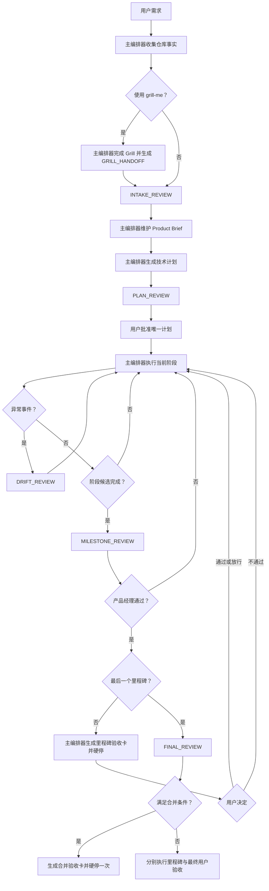

# PRD：CCG 产品经理角色与主编排器调用机制

**状态：** Requirements Confirmed（待 CCG 实施计划）

**创建日期：** 2026-07-26

**最后更新：** 2026-07-27

**首个落地边界：** Codex-led CCG

**主责任方：** CCG 主编排器

**新增逻辑角色：** Product Manager（产品经理）

**执行提供者：** 用户在安装时选择的受支持 CLI，不绑定单一模型或厂商

## 1. 摘要

CCG 新增一个稳定、提供者中立的 `Product Manager` 逻辑角色，用于识别用户真正的痛点、挑战技术计划的产品完整性、发现执行偏航、验收阶段里程碑并评估整个项目的完成程度。

产品经理不是第二个主编排器，也不是后台常驻进程。主编排器拥有唯一的任务生命周期、模型调用、工作区写入、状态更新、流程暂停与恢复权。产品经理只在主编排器定义的检查点被调用，读取有界上下文并返回结构化的只读判断。

核心工作流为：

```text
主编排器识别事件
→ 收集仓库事实、计划与执行证据
→ 调用产品经理
→ 校验产品经理结构化输出
→ 主编排器更新唯一任务状态
→ 主编排器执行、整改或暂停
```

若用户使用 `grill-me`，必须先由主编排器完成 Grill，再把结构化结论交给产品经理。项目计划中的每个一级阶段都是里程碑；没有多阶段计划的产品任务自动拥有一个隐式里程碑。每个里程碑均执行“产品经理验收 + 用户验收”双重硬门禁。

## 2. 问题陈述

当前 Codex-led CCG 已有工程规划、实现、审查和多模型证据能力，但没有一个稳定角色持续回答以下问题：

1. 用户真正痛在哪里，而不是字面上要求了什么方案？
2. 当前执行流程是否遗漏步骤、停滞、反复失败或偏离产品目标？
3. 代码、测试和文档已经产生后，项目是否真的达到产品完成状态？
4. 当前最应该做的唯一下一步是什么？

缺少该角色会导致：

- 技术方案正确，但解决的不是用户真正的问题；
- 隐藏假设、目标、非目标和验收标准未在实施前收敛；
- 计划阶段与用户价值之间缺少独立校验；
- “代码写完”被误认为“里程碑完成”；
- 项目阶段完成后没有全局进度、偏航和下一步评估；
- 多个模型各自维护计划，形成互相冲突的事实来源；
- 产品角色与 Claude 或其他单一 CLI 绑定，造成可用性和厂商锁定；
- 如果每条技术命令都调用产品经理，则产生不必要的延迟、成本和噪声。

## 3. 产品目标

### 3.1 必须实现

- 为 CCG 增加提供者中立的产品经理角色合同。
- 由主编排器在明确事件点调用产品经理，而非让产品经理自行监听流程。
- 让产品经理识别真实痛点，同时把事实、推断、置信度和验证方式分开。
- 在技术计划批准前检查产品目标、范围、用户价值、验收标准和里程碑覆盖。
- 在异常偏航、里程碑候选完成和最终交付时进行产品评估。
- 用证据化里程碑矩阵计算项目进度，不允许模型凭感觉报告完成百分比。
- 每个里程碑先经过产品经理验收，再硬停等待用户验收。
- 每次验收后告诉用户唯一推荐的下一条 CCG 指令或行动。
- 允许用户逐检查点明确放行，但不得伪装成正常验收通过。
- 支持用户在安装时选择 Claude、Codex、Gemini 或其他被当前策略允许的兼容 CLI。
- 保持 Codex 为首个落地模式中的唯一工作区写入者和最终工程验证责任方。

### 3.2 非目标

- 不把产品经理变成第二个主编排器。
- 不允许产品经理直接执行 CCG 命令、写文件、修改代码或控制子代理。
- 不维护独立于 Trellis、PRD、Spec 或正式 CCG 计划的第二套项目计划。
- 不要求每条普通技术命令都调用产品经理。
- 不强制依赖 Claude 或任何单一提供者。
- 不用产品经理取代架构、UI/UX、安全、外部情报或工程审查角色。
- 不在首个版本建设通用路线图、产品分析或团队管理平台。

## 4. 角色与权责

| 角色 | 负责 | 不负责 |
|---|---|---|
| 用户 | 确认产品目标、重大变更和每个里程碑；可显式放行 | 不需要维护内部任务状态 |
| 主编排器 | 识别事件、收集事实与证据、调用产品经理、更新任务状态、执行门禁、调度实现与验证 | 不得伪造产品经理结论 |
| 产品经理 | 痛点判断、计划挑战、偏航评估、里程碑验收、三维进度、唯一下一步建议 | 不执行命令、不写状态、不改代码、不直接控制流程 |
| 实现者/子代理 | 完成受派技术工作并返回证据 | 不自行调用产品经理，不宣告里程碑最终完成 |
| 专家角色 | 在架构、UI/UX、安全、外部事实等领域提供专项证据 | 不替代产品决策或任务生命周期 |

### 4.1 唯一控制权

- 主编排器是产品经理调用的唯一发起者。
- 产品经理输出是结构化判断和建议；所有状态变更由主编排器执行。
- 主编排器必须校验产品经理输出格式、任务身份、计划摘要和证据摘要。
- 实现子代理不得调用产品经理，避免并发角色争抢和重复成本。
- 产品经理不能绕过主编排器直接向用户提问；需要用户决策时返回结构化请求。

### 4.2 “持续存在”的准确含义

产品经理不需要持续进程或固定任务会话。持续性来自主编排器维护的规范化任务产物：

- 产品简报；
- 已批准计划及摘要；
- Grill 交接包；
- 里程碑矩阵；
- 产品经理历次结论；
- 用户验收和放行记录；
- 当前风险、偏航和推荐下一步。

主编排器在每次调用时重新提供这些有界产物。CLI 会话复用仅是可选优化，不是正确性依赖。

## 5. 主编排器的五类调用点

主编排器只能通过以下五类语义事件调用产品经理。命令名只是事件来源，不是产品经理自行触发的入口。

### 5.1 `INTAKE_REVIEW`：需求入口

调用顺序：

1. 主编排器读取用户需求、现有任务产物和仓库事实。
2. 如果用户启用了 `grill-me`，先完成 Grill 和 `GRILL_HANDOFF`。
3. 主编排器调用产品经理，要求识别真实痛点、重要歧义、成功标准和非目标。
4. 产品经理返回产品简报建议或需要用户决定的问题。
5. 主编排器校验并建立或更新规范化产品简报。

任务清晰、低风险且事实充分时，产品经理不得为了形式完整而制造无意义追问。

### 5.2 `PLAN_REVIEW`：计划批准前

调用顺序：

1. 主编排器基于真实仓库和已确认产品简报生成技术计划草案。
2. 主编排器调用产品经理检查产品目标、用户价值、范围、验收标准和里程碑覆盖。
3. 产品经理不得重写或替换技术计划，只能返回缺口、风险和调整建议。
4. 主编排器处理建议后，把唯一正式计划交给用户批准。

### 5.3 `DRIFT_REVIEW`：异常事件

主编排器在以下任一条件发生时调用：

- 用户提出目标、范围、优先级或验收变化；
- 执行结果与已批准计划明显不一致；
- 同类失败反复出现；
- 证据互相冲突；
- 出现重大依赖、安全、兼容性、数据或发布风险；
- 用户反馈使上一轮产品判断失效；
- 原定下一步已不再合理。

产品经理不持续轮询任务。未出现上述事件时，同一阶段内的普通实现和验证不调用产品经理。

### 5.4 `MILESTONE_REVIEW`：里程碑候选完成

调用顺序：

1. 实现者向主编排器提交阶段完成声明和证据。
2. 主编排器先运行并收集适用的测试、审查和质量门禁结果。
3. 主编排器调用产品经理评估目标达成、产品价值、范围漂移、证据完整性和全局进度。
4. 产品经理返回 `accepted`、`rejected`、`needs_user_decision` 或 `reopen_request`。
5. 主编排器根据结论整改、请求用户决策，或生成用户验收卡并硬停。

进入新阶段时不固定重复调用产品经理。上一里程碑的评估已经给出下一步；只有状态或计划发生变化时才补充 `DRIFT_REVIEW`。

### 5.5 `FINAL_REVIEW`：最终交付

主编排器汇总：

- 所有里程碑状态；
- 用户验收和放行项；
- 完成矩阵；
- 测试、审查和质量门禁；
- 遗留风险和未验证声明；
- 最终交付物。

产品经理据此判断整个产品目标是否真正达成，并给出最终产品结论。主编排器随后生成最终用户验收卡并等待用户决定。

最终一级阶段仍必须独立触发 `MILESTONE_REVIEW`，不得用 `FINAL_REVIEW` 代替。为避免对相同交付连续要求用户验收两次，在满足以下全部条件时，主编排器必须把“最后里程碑验收卡”和“最终用户验收卡”合并为一张卡和一次硬停：

- 最后里程碑的范围、证据和产品经理结论在 `FINAL_REVIEW` 前后均未变化；
- `FINAL_REVIEW` 没有发现新的风险、范围差异、证据缺口或用户决策项；
- 先前里程碑的验收记录仍然有效；
- 合并卡明确列出最后里程碑结论、最终产品结论，以及一次用户响应将同时作用于两个检查点。

一次用户响应必须原子记录两个检查点的验收结果。任一条件不满足时，必须保留两次独立验收。两次验收之间的状态、证据或用户决定发生变化时，原 `FINAL_REVIEW` 立即标记为陈旧并重新执行。



## 6. Grill 与产品经理交接

### 6.1 顺序

```text
用户提出需求
→ 主编排器执行 grill-me
→ 一次解决一个决策
→ Grill 达到完成条件
→ 主编排器生成 GRILL_HANDOFF
→ 主编排器调用 INTAKE_REVIEW
→ 主编排器建立或更新 Product Brief
```

Grill Skill 不直接调用产品经理，产品经理也不参与 Grill 的每轮提问。

### 6.2 `GRILL_HANDOFF` 内容

- 用户原始需求；
- 已核实的仓库事实；
- 已确认决策；
- 被否决方案及原因；
- 产品目标、范围和非目标；
- 验收偏好与流程约束；
- 非阻塞假设和风险；
- 对话或任务产物引用。

### 6.3 决策重开

- Grill 已确认决策默认成为权威约束。
- 产品经理不得重复询问或自行覆盖。
- 只有发现新的事实冲突、重大遗漏或高风险后果时，产品经理才能返回 `reopen_request`。
- `reopen_request` 必须包含新证据、影响、置信度和推荐答案。
- 主编排器决定是否重新进入 Grill；若进入，仍一次只向用户提出一个问题。

## 7. 里程碑规则

### 7.1 显式里程碑

- Trellis、PRD、Spec 或用户批准的正式计划中明确的里程碑具有最高优先级。
- 当 `/ccg:plan` 产出整个项目规划时，每个一级阶段自动成为一个里程碑。
- 阶段内普通任务、文件修改、单项测试和内部 Gate 默认不是独立里程碑，除非正式计划明确提升。

### 7.2 隐式里程碑

没有多阶段计划时，只要任务改变以下任一产品结果，整个任务自动成为一个隐式里程碑：

- 功能或用户体验；
- 业务行为或接口；
- 数据行为；
- 性能、可靠性或质量表现；
- 可供用户验收的分析、研究或审查交付。

### 7.3 不单独建立里程碑

纯安装、诊断、上下文查看、Git/Worktree 管理、外部证据收集、文档生成和单项质量检查默认只提供证据。它们只有在关闭已有阶段或暴露重大偏航时，才使主编排器触发对应产品经理事件。

## 8. 双重验收与状态机

### 8.1 双重硬门禁

```text
技术完成声明
→ 主编排器验证工程证据
→ 产品经理里程碑验收
→ 主编排器生成用户验收卡
→ 强制暂停
→ 用户验收
→ 主编排器恢复计划
```

- 产品经理未通过：阶段退回整改；用户可以明确放行。
- 产品经理通过：里程碑进入 `awaiting_user_acceptance`，不得进入下一阶段。
- 用户未回复：一直暂停，不允许超时自动通过。
- 用户通过后：已启动的完整执行自动恢复，无需重新输入 `/ccg:execute`。

### 8.2 规范化状态

里程碑主状态：

- `not_started`
- `in_progress`
- `blocked`
- `awaiting_user_acceptance`
- `completed`
- `user_overridden`

产品经理评估独立记录：

- `accepted`
- `rejected`
- `needs_user_decision`
- `reopen_request`
- `unavailable`

不得用同一个 `accepted` 同时代表产品经理通过和用户通过。

`user_overridden` 仅是里程碑主状态，不是产品经理结论。它是允许计划继续推进的终态，但不代表产品经理验收或用户正常验收通过，也不得计入正常产品验收：

- 产品经理不可用后用户放行：保留 `pm_verdict=unavailable`，设置 `milestone_status=user_overridden`。
- 产品经理拒绝后用户放行：保留 `pm_verdict=rejected`，设置 `milestone_status=user_overridden`。
- 产品经理通过但用户选择放行：保留 `pm_verdict=accepted`，设置 `milestone_status=user_overridden`，并从正常产品验收分子中排除。

里程碑被声明为候选完成但尚未获得产品经理结论时，主状态仍为 `in_progress`。候选完成是一次事件和证据声明，不新增不可追踪的隐式状态。

### 8.3 用户验收响应

- `验收通过`：标记为 `completed`，主编排器恢复计划。
- `验收不通过：<原因>`：退回 `in_progress`，主编排器组织整改。
- `忽略风险并继续`：标记为 `user_overridden`，记录风险并恢复计划。

最终验收也允许用户显式放行，但任务只能报告为 `completed_with_overrides`，不得声称经过完整产品验收。

## 9. 用户验收卡

每个里程碑暂停时必须展示：

- 里程碑原定目标；
- 实际交付内容；
- 用户可见或可操作的变化；
- 最短验收步骤和预期结果；
- 测试、审查和质量门禁证据；
- 未完成项、已知问题和遗留风险；
- 产品经理结论；
- 三维项目进度；
- 验收通过后的唯一下一步；
- 用户可选择的三种响应。

主编排器负责生成和展示验收卡。产品经理只提供验收内容和建议，不直接控制用户界面或暂停机制。

## 10. 三维项目进度

产品经理不得凭感觉报告单一百分比。每次 `MILESTONE_REVIEW` 和 `FINAL_REVIEW` 均返回：

1. **实施推进度**：主状态为 `awaiting_user_acceptance`、`completed` 或 `user_overridden` 的一级阶段数量或权重。
2. **产品验收度**：基于当前有效交付物，获得产品经理 `accepted` 的一级阶段数量或权重。
3. **项目健康度**：绿色、黄色或红色，并列出决定颜色的阻塞、偏航、放行、证据缺口和重大风险。

示例：

```text
总体阶段：5
实施推进：3/5（60%）
产品验收：2/5（40%）
等待用户验收：1
用户放行：0
项目健康：黄色
当前阶段：阶段 3 - 集成验证
唯一下一步：等待用户验收；通过后执行 /ccg:test ...
```

计算规则：

- 正式计划有权重时按权重计算；
- 无权重时按一级阶段等权计算；
- 状态变化导致证据失效时，原产品经理结论必须标记为陈旧并重新评估；
- `not_started`、`in_progress` 和 `blocked` 不计入实施推进分子；候选完成声明本身也不计入；
- `user_overridden` 可以计入实施推进，不计入正常产品验收；
- 产品验收分子要求当前产品经理结论为 `accepted`，且里程碑主状态不是 `user_overridden`；
- 完整里程碑矩阵和证据是权威来源，百分比只是派生视图。

## 11. 两级调整权

产品经理没有直接调整权，只能返回建议。主编排器按以下两级执行：

### 11.1 主编排器可自动应用的流程调整

在不改变已确认产品目标、范围和验收标准时，主编排器可以根据产品经理建议：

- 调整下一条 CCG 指令；
- 让当前阶段返工；
- 调整同一里程碑内部任务顺序；
- 增加调研、验证、测试、审查或证据收集；
- 标记风险、阻塞和偏航；
- 把证据不足的阶段退回 `in_progress` 或 `blocked`。

所有调整必须留痕。

### 11.2 必须由用户批准的产品变更

以下变化只能由产品经理提出变更提案，再由主编排器请求用户批准：

- 用户痛点或产品目标；
- 功能范围、非目标或优先级；
- 对外行为、兼容性、安全边界或数据处理；
- 验收标准、里程碑定义或发布条件；
- 明显增加成本、工期或风险的工作。

用户批准后，主编排器修订原有权威产物，不创建第二套计划。

## 12. 命令到事件的映射

下表描述主编排器如何把现有 44 个命令映射为事件。命令本身不直接“唤醒”产品经理。

| 命令类别 | 命令 | 主编排器行为 |
|---|---|---|
| 产品入口与规划 | `go`、`workflow`、`feat`、`plan`、`spec-research`、`spec-plan`、`team`、`team-research`、`team-plan`、`gptpro-plan` | 新产品任务触发 `INTAKE_REVIEW`；计划草案交用户前触发 `PLAN_REVIEW` |
| 实施 | `backend`、`frontend`、`debug`、`optimize`、`test`、`execute`、`excute`、`codex-exec`、`spec-impl`、`team-exec`、`gptpro-exc` | 普通执行不调用；异常触发 `DRIFT_REVIEW`；候选完成触发 `MILESTONE_REVIEW` |
| 审查与质量证据 | `review`、`spec-review`、`team-review`、`gptpro-review`、`verify-change`、`verify-module`、`verify-quality`、`verify-security`、`grok-verify` | 结果先写入证据；关闭阶段或推翻判断时触发里程碑或偏航事件 |
| 分析与辅助证据 | `analyze`、`enhance`、`grok-intel`、`gemini-preview`、`gen-docs` | 默认只提供输入或证据；独立用户交付形成隐式里程碑 |
| 工具与生命周期维护 | `ccg`、`doctor`、`init`、`spec-init`、`context`、`commit`、`rollback`、`clean-branches`、`worktree` | 默认不创建产品任务和调用；阻塞已有任务时触发异常事件 |

特殊规则：

- `ccg` 携带任务或计划并委托其他工作流时，按被委托工作流的实际事件处理。
- `enhance` 只优化输入；正式建立产品任务时才执行 `INTAKE_REVIEW`。
- 独立分析、研究或审查交付只设置一个最终隐式里程碑，不插入无意义的中间产品经理调用。
- 未来新增命令按实际效果分类，不依赖命令名称。

## 13. 自适应痛点发现

产品经理在 `INTAKE_REVIEW` 中必须区分：

- 用户字面要求；
- 可能的真实痛点；
- 用户提出的手段与期望结果；
- 已知事实；
- 产品推断；
- 置信度；
- 验证方式。

输出的痛点假设至少包含：

- 目标用户；
- 当前痛点；
- 期望结果；
- 成功标准；
- 非目标；
- 未验证假设。

若重要歧义会改变范围、数据、安全、兼容性、用户体验或验收标准，产品经理返回一个关键问题及推荐答案。主编排器一次只向用户提出一个问题。能从仓库或已有产物查到的事实不得反问用户。

## 14. 提供者、安装与失败策略

### 14.1 安装时选择

- 安装 CCG 时，由用户选择哪个被当前策略允许且能力兼容的 CLI 承担产品经理。
- 角色合同不得写死 Claude、Codex、Gemini 或其他厂商名称。
- 安装器不得把当前项目策略禁止的提供者列为可用选项，也不得暗中调用。
- 安装级产品经理选择是唯一选择来源；项目或任务只提供允许/禁止约束，不再建立第二个产品经理绑定。
- 在 Harness 项目中，有效提供者必须同时满足“安装级已选择”和“当前 Harness 合同允许”。不满足时按 `unavailable` 暂停，不得自动改用其他 CLI。
- 选择产品经理不等于批准安装 CLI、登录账号、联网、读取凭据或产生付费调用；这些动作仍遵循各自的显式批准流程。
- 为兼容现有安装，可显式选择禁用产品经理；一旦启用，强制检查点按本 PRD 执行。
- 当前 Codex-native 托管策略禁用 Claude，因此首个实现不能调用或要求 Claude；未来只有在权威策略允许后，Claude 才能作为可选适配器。

### 14.2 不做任务级绑定

- 不建立额外的任务级提供者绑定和正式换人交接机制。
- 用户修改安装配置后，后续调用使用新提供者。
- 新提供者通过规范化任务产物恢复上下文。
- 会话复用可以优化成本和连贯性，但不能成为正确性依赖。

### 14.3 失败与用户放行

1. 提供者异常包括启动失败、超时、非零退出、空输出、结构解析失败、必填字段缺失、身份或摘要不匹配、陈旧响应，以及引用的必需证据已失效。
2. 可恢复的临时错误允许使用同一调用键进行有界重试；重试不得创建并行的第二次评估。
3. 重试后仍失败或输出校验失败时，主编排器记录提供者、错误、检查点、调用键和影响，并将本次产品经理评估记录为 `unavailable`。
4. 陈旧响应不得写入状态；主编排器应按最新输入创建新调用，或在强制检查点暂停。
5. 不允许静默切换到其他 CLI，也不允许主编排器伪造产品经理结论。
6. 强制检查点默认暂停。
7. 用户可修复原提供者、修改安装配置后重试，或明确放行当前检查点。
8. 放行仅作用于当前检查点；后续产品经理调用仍照常发生。
9. 放行只把里程碑主状态记录为 `user_overridden`；产品经理原结论保持 `unavailable`、`rejected` 或 `accepted`，不得改写为正常验收通过。

## 15. 产品经理调用合同

### 15.1 输入

主编排器按触发类型提供最小必要信息：

- 任务 ID 与触发类型；
- 检查点 ID 与计划修订号；
- 用户原始需求；
- Product Brief；
- `GRILL_HANDOFF`（若存在）；
- 已批准计划与当前里程碑；
- 仓库事实和架构约束摘要；
- 测试、审查、门禁和交付证据引用；
- 当前风险、偏航、用户反馈和历史放行；
- 前一轮产品经理结论及摘要；
- 输入摘要和证据摘要。

必须移除凭据、秘密和无关源代码。

### 15.2 输出

每次调用必须返回可校验结构，至少包含：

- `trigger_type`
- `task_id`
- `checkpoint_id`
- `plan_revision`
- `invocation_key`
- `input_digest`
- `evidence_digest`
- `verdict`
- `facts`
- `hypotheses`
- `findings`
- `evidence_refs`
- `progress`
- `risks`
- `recommended_next_action`
- `process_adjustments`
- `material_change_proposal`
- `reopen_request`
- `user_acceptance_summary`
- `provider_identity`
- `contract_version`
- `generated_at`

`recommended_next_action` 必须是一个主要建议，不得只返回没有优先级的菜单。需要用户决定时，可附有限备选及推荐项。

### 15.3 幂等、并发与陈旧响应

主编排器必须在调用前通过规范化 JSON 和 SHA-256 生成稳定调用键：

```text
sha256(canonical_json({
  contract_version,
  task_id,
  trigger_type,
  checkpoint_id,
  plan_revision,
  input_digest,
  evidence_digest
}))
```

- canonical JSON 必须固定字段集合、字段顺序、Unicode 和空值规则，禁止直接拼接未转义字符串。
- 同一调用键只能存在一个进行中的产品经理调用；重复事件、重复完成声明和并发 Hook 必须通过跨进程原子锁或 CAS 复用同一个进行中调用。
- 同一调用键已产生通过校验的结果时，重试和流程恢复必须复用该结果，不得重复计费或生成第二个结论。
- 输入、证据、计划修订或检查点发生变化时必须生成新调用键，不得复用旧结论。
- 调用日志至少记录 `pending`、`completed`、`failed`、`stale`、结果摘要和时间戳，以支持崩溃恢复和审计。
- 主编排器在应用结果前必须再次核对任务、检查点、计划修订、输入摘要和证据摘要；任何不匹配的响应均为陈旧响应，不得改变里程碑或任务状态。
- 过期调用返回后只能保留为审计证据；它不能覆盖较新的有效结论，也不能解除暂停。

### 15.4 安全边界

提供者调用必须：

- 使用只读、非交互或受控交互模式；
- 禁止工作区写入和终端执行；
- 使用超时和输出大小限制；
- 校验任务身份、计划摘要和证据摘要；
- 不保存隐藏推理或敏感数据；
- 记录提供者、模型、CLI 版本、合同版本和证据摘要。

## 16. 事实来源与产物

### 16.1 生命周期权威

- Trellis 存在时，Trellis 是唯一任务生命周期权威；产品经理状态附着或引用到 Trellis 任务，不创建平行 `.ccg/tasks`。
- 非 Trellis 项目复用现有 `.ccg/tasks/<task-id>/task.json` 和 `evidence.json`。
- 正式 PRD、Spec 和计划继续由其现有权威位置管理；Trellis 项目中的 CCG 计划必须更新或引用 Trellis `implement.md`，不得成为第二个计划权威。

### 16.2 产品经理产物

实现计划应在现有任务目录中扩展一个规范化产品经理状态，包含：

- Product Brief；
- Grill 交接引用；
- 里程碑矩阵；
- 历次触发记录和结论；
- 用户验收与放行记录；
- 三维进度；
- 当前唯一下一步。

人类可读报告可以从机器状态生成，但不能成为第二事实来源。

## 17. `jed-zed/trellis-ccg-harness` 适配合同

本 PRD 的首个 Harness 兼容目标是 [`jed-zed/trellis-ccg-harness`](https://github.com/jed-zed/trellis-ccg-harness)。实现必须遵守该仓库当前的 Trellis/CCG 分层适配器、协作策略、来源清单和冲突审计；Harness 规则比独立 CCG 默认行为优先。

本次兼容基线核对的是 2026-07-27 的公开 `main`（远端 HEAD `8eb050df4e1f3c9c4bbc39c377ca22d9b16407db`）。当时 `harness.sources.json` 记录 Trellis `0.6.9`、CCG `3.3.3` 和个人 CCG commit `8bdad64e4e5ccad75e1086ae31ad757e6bbdbef8`。这些值用于明确本 PRD 的核对依据，不是未来实现可硬编码的永久版本；实施和发布前必须重新读取来源清单与当前策略。

### 17.1 权威边界和流程顺序

- Trellis 继续拥有任务身份、生命周期状态、需求、PRD、设计、实施计划、规范、验收标准、完成和归档。
- CCG 拥有模型编排、产品经理适配器、辅助证据、质量、安全、测试和审查门禁。
- Codex 继续是唯一工作区写入者和 inline 主编排器。产品经理无论由哪个 CLI 承担都必须保持只读。
- 第 8 节定义的里程碑状态是附着于 Trellis 任务的产品检查点投影，不得替换或私自改写 Trellis 任务状态。
- 产品经理 verdict 和用户验收记录是 Trellis 完成判定所需的证据与门禁，不直接把任务标记为完成；最终状态转换、`finish-work` 和归档仍由 Trellis 流程执行。
- 产品经理建议若与已接受的 Trellis `prd.md`、`design.md`、`implement.md`、Spec 或验收标准冲突，必须返回 `material_change_proposal`。用户批准后先更新原 Trellis 产物，再生成新计划修订和调用键。

Harness 中的规范顺序为：

```text
确认需求
→ Trellis task / prd.md / design.md / implement.md / Spec
→ 最小 CCG 计划与模型协作
→ 实现
→ Trellis + CCG 质量、安全、测试和审查门禁
→ 产品经理里程碑或最终评估
→ 用户验收
→ Trellis 状态转换、finish-work 与归档
```

产品经理不得跳过、缩减、替换或重新定义 Trellis 与 CCG 的必需门禁。

### 17.2 任务与证据映射

- `task_id` 必须直接使用当前 Trellis 任务身份；产品经理桥接器必须接受 `.trellis/tasks/<task>/`，不得复制任务到 `.ccg/tasks/`。
- `prd.md` 是需求与验收权威，`design.md` 是复杂任务的技术设计权威，`implement.md` 是复杂任务的执行计划权威。
- Product Brief 和 `GRILL_HANDOFF` 在 Harness 中必须写入或引用当前 Trellis task 的 `prd.md`/任务产物；产品经理缓存中的副本只用于调用上下文，不得成为第二需求来源。
- 里程碑 ID 必须从已批准的 `implement.md` 一级阶段或隐式里程碑规则确定，并在计划修订间保持可追踪。
- 产品经理的原始请求、原始响应、摘要、调用日志和证据引用只能作为 task-local helper evidence 存放在 `.trellis/tasks/<task>/.ccg-evidence/product-manager/`。
- 生命周期状态、用户批准、验收结果和完成状态必须通过 Trellis 支持的任务产物或扩展记录维护；`.ccg-evidence/` 不能成为生命周期权威。
- 根目录 `.ccg/` 和 `.codex/ccg/` 只允许保存被忽略的临时运行证据，永远不得提交，也不得作为恢复任务状态的唯一来源。
- 已存在适用 Trellis 产物时必须原位更新或引用，不得重新 Grill、重复创建 PRD、Spec、任务或实施计划。

### 17.3 Harness 提供者与安装约束

- 安装级产品经理选择保存在 CCG 运行时配置中；Harness 项目合同只负责提供者 allow/deny、只读、网络、付费和安全约束，不创建项目级或任务级替代选择。
- `harness-init`、`.harness/project.json`、`.harness/adapter.json` 和当前项目策略共同决定所选提供者能否在该项目中运行。
- 当前目标 Harness 中 Claude 被禁用且不得产生 `.claude/` 运行面；Grok 默认关闭且可选；Gemini 仅能只读；Codex 是唯一写入者。首个兼容版本必须保持这些默认边界。
- Codex 同时承担主编排器和产品经理提供者时，产品经理调用仍必须进入独立的只读能力边界，不能继承主编排器的写入和终端权限。
- Provider 的安装、登录、联网和付费调用必须分别获得 Harness 要求的显式批准。项目初始化和普通 CI 使用离线夹具，不得调用付费模型或读取本机登录状态。
- 所选提供者被 Harness 禁止、未配置或能力不兼容时，必须按第 14.3 节暂停或由用户逐检查点放行，不得静默切换。

### 17.4 Hook 与编排兼容

- 产品经理不得新增常驻监听器，也不得新增与 Trellis `UserPromptSubmit` 重叠的项目级或用户级 Hook。
- 五类事件由 inline 主编排器根据 Trellis 当前任务、已批准产物和 CCG 执行结果识别；命令、Skill、Hook 和实现子代理只能上报事件候选。
- 项目级 Trellis Hook 保持高于用户级 fallback Hook 的优先级。产品经理能力不得改变现有 yield marker 或 hook ownership。
- CCG team 命令不是该 Harness 的默认执行入口；即使未来启用子代理执行，也只有 inline 主编排器可以发起产品经理调用和写入 Trellis 状态。
- 如果未来增加 Harness 事件桥，必须扩展现有内部 adapter，而不是引入第三套生命周期框架，并通过第 15.3 节的调用键去重。

### 17.5 来源、投影与升级

- 产品经理功能先在 CCG 权威源码中实现；Harness 通过 `harness.sources.json` 固定的个人 CCG commit、Git tree 和安装版 CLI/plugin 消费该功能。
- `components/ccg-workflow/` 是来源快照和 provenance，不是 Harness 的直接执行运行时；不得从该目录绕过已安装版本运行产品经理。
- Harness 接入时必须同步更新来源清单、组件快照、安装版插件和版本校验，防止源码、快照与运行时漂移。
- 若需要修改协作策略，只能修改 Harness 发行版拥有的策略源和初始化模板，再由 `harness-init` 更新项目固定副本与 `AGENTS.md` 托管块；不得手工编辑投影结果。
- Harness schema、ownership manifest 和初始化事务必须采用向后兼容迁移，保留未知的用户资产，并在摘要或所有权冲突时 fail closed。

### 17.6 Harness 强制验收门禁

涉及本功能的 Harness 集成至少必须通过：

- `node scripts/harness-adapter.mjs context` 能直接读取当前 Trellis task 和产物摘要；
- `node scripts/harness-adapter.mjs conflicts` 无 Blocking；
- `pnpm harness:test`；
- CCG 的 lint、typecheck、test 和 build；
- CCG 版本、个人 commit、Git tree、Harness snapshot 和已安装插件的来源一致性检查；
- 离线 clean-install/Project Init 测试，确认未创建或修改 `.claude/`，未隐式安装、登录或调用 Provider；
- 端到端夹具证明没有 `.ccg/tasks` 平行生命周期，task-local `.ccg-evidence/` 不会改写 Trellis 生命周期字段；
- 重复 Hook、并发完成事件、恢复和重试只产生一次有效产品经理评估。

上述任一必需门禁失败时，不得宣称兼容 Harness，也不得进入 Trellis 完成或归档。

## 18. 完成判定

正常 `completed` 必须同时满足：

- 所有必需里程碑均为 `completed`；
- 最终产品经理评估为 `accepted`；
- 最终用户验收通过；
- 所有强制质量和安全门禁通过；
- 没有未解决 blocker；
- 所有完成声明都有直接证据；
- 未批准的范围漂移为零。

如存在用户放行，任务可以结束，但必须使用 `completed_with_overrides`，列出每个放行点和风险。

在 Harness 项目中，上述条件只授权主编排器请求 Trellis 完成转换；只有 Trellis 成功执行完成与归档流程后，任务生命周期才算关闭。

## 19. 功能需求

- **FR-001** 主编排器必须是产品经理调用的唯一发起者。
- **FR-002** 产品经理不得写工作区、执行命令或控制子代理。
- **FR-003** 系统必须实现五类语义调用点。
- **FR-004** 使用 Grill 时必须完成 `GRILL_HANDOFF` 后再调用 `INTAKE_REVIEW`。
- **FR-005** Grill 已确认决策只能凭新证据和重大影响申请重开。
- **FR-006** 完整项目计划的每个一级阶段必须成为里程碑。
- **FR-007** 无计划产品任务必须创建一个隐式里程碑。
- **FR-008** 每个里程碑必须经过产品经理和用户双重验收。
- **FR-009** 用户验收前流程必须无限期暂停，不得超时放行。
- **FR-010** 用户验收通过后，已启动计划必须自动恢复。
- **FR-011** 用户必须能够逐检查点明确放行。
- **FR-012** 放行不得记录为正常产品经理或用户验收通过。
- **FR-013** 系统必须输出实施推进度、产品验收度和项目健康度。
- **FR-014** 所有进度必须由里程碑矩阵和权重派生。
- **FR-015** 每次里程碑暂停必须展示固定用户验收卡。
- **FR-016** 产品经理必须返回唯一推荐下一步。
- **FR-017** 流程内调整由主编排器执行，重大产品变化必须请求用户批准。
- **FR-018** 产品经理提供者必须由用户在安装时选择。
- **FR-019** 提供者失败不得静默切换；强制点默认暂停。
- **FR-020** 角色连续性必须依赖规范化产物，而非固定提供者会话。
- **FR-021** Trellis 存在时不得创建平行任务生命周期。
- **FR-022** 实现子代理不得自行调用产品经理。
- **FR-023** 当前策略禁止的提供者不得被安装器展示或运行。
- **FR-024** 产品经理的真实痛点推断必须标记证据、置信度和验证方式。
- **FR-025** 每次产品经理调用必须使用稳定调用键，并对重复事件、并发事件和重试执行 single-flight。
- **FR-026** 任务、检查点、计划修订、输入摘要或证据摘要不匹配的陈旧响应不得改变状态。
- **FR-027** `user_overridden` 只能作为里程碑状态；产品经理原 verdict 必须保持可审计。
- **FR-028** 实施推进度只能由 `awaiting_user_acceptance`、`completed` 和 `user_overridden` 计算。
- **FR-029** 最后里程碑与最终验收满足等价条件时必须合并为一张卡和一次硬停，否则必须分开。
- **FR-030** 空输出、畸形输出、缺字段、身份不匹配和失效证据必须按不可用或陈旧响应 fail closed。
- **FR-031** 在目标 Harness 中，Trellis 必须继续拥有任务、需求、计划、验收、完成与归档权威。
- **FR-032** Harness 桥接器必须直接接受 Trellis task，并把产品经理原始证据隔离到 task-local `.ccg-evidence/product-manager/`，不得创建 `.ccg/tasks`。
- **FR-033** Harness 中的有效产品经理提供者必须是安装级选择与项目合同允许集合的交集。
- **FR-034** 产品经理能力不得新增与 Trellis 重叠的 Hook、常驻监听器或第二个编排器。
- **FR-035** Harness 必须通过 `harness.sources.json` 固定的 CCG 来源和匹配的已安装 CLI/plugin 运行产品经理，不得直接执行组件快照。
- **FR-036** 产品经理 Harness 集成必须通过 context、conflicts、Harness 测试和 CCG 全部门禁后才能声明兼容。
- **FR-037** 当前目标 Harness 的首个兼容版本不得创建、修改、探测或调用 `.claude/` 运行面。
- **FR-038** 选择产品经理提供者不得被解释为对安装、登录、联网、凭据读取或付费调用的授权。

## 20. 验收标准

1. 模糊新功能在仓库事实收集后触发一次 `INTAKE_REVIEW`，而不是产品经理自行监听。
2. 使用 `grill-me` 时，产品经理只在 Grill 完成并生成交接包后被调用。
3. 产品经理不得重复询问 Grill 已确认事项，除非返回合格 `reopen_request`。
4. 技术计划由主编排器生成，产品经理只能挑战，不能替换。
5. 同一阶段普通实现命令不会反复调用产品经理。
6. 重大偏航事件会触发 `DRIFT_REVIEW`，且输出能够改变主编排器的后续流程建议。
7. `/ccg:plan` 的每个一级阶段在任务状态中都有对应里程碑。
8. 小型产品修复没有显式计划时仍产生一个隐式里程碑。
9. 里程碑候选完成前，主编排器已收集适用工程证据。
10. 产品经理通过后流程进入 `awaiting_user_acceptance`，用户未响应时不继续。
11. 用户选择通过、不通过或放行会产生正确状态转换和审计记录。
12. 用户通过后原执行上下文自动续跑，无需重新发起执行命令。
13. 三维进度可以从里程碑矩阵确定性重算。
14. 产品经理失败时不换人，用户明确放行后只跳过当前检查点。
15. 最终正常完成无法包含未披露的 `user_overridden`。
16. Trellis 项目不生成平行 `.ccg/tasks` 状态。
17. 任何产品经理适配器都无法写工作区或调用终端。
18. 所有产品经理输出记录真实提供者身份和合同版本。
19. 同一里程碑的重复完成信号、并发 Hook 和重试只产生一个有效调用和一个产品经理结论。
20. 较旧调用晚于新调用返回时，只保留审计记录，不覆盖新状态或解除暂停。
21. 用户放行后产品经理 verdict 保持原值，里程碑单独进入 `user_overridden`。
22. 候选完成声明不直接增加实施推进度，三维进度只按规范化状态确定性计算。
23. 最后里程碑与最终验收条件等价时只展示一张合并卡；存在新风险或新决策时展示两张独立卡。
24. 空、畸形、缺字段、身份不符或证据失效的产品经理输出无法通过门禁。
25. Harness adapter 直接读取当前 Trellis task，且全过程不创建 `.ccg/tasks`。
26. 产品经理原始证据位于 task-local `.ccg-evidence/product-manager/`，不能修改 Trellis 生命周期字段。
27. 安装级所选提供者被项目合同禁止时调用暂停，不会切换到其他 Provider。
28. 产品经理接入不增加重复 `UserPromptSubmit` Hook，且保持 Codex inline 主编排器唯一调用权。
29. Harness 运行时使用与 `harness.sources.json` 匹配的已安装 CCG CLI/plugin，而不是组件源码快照。
30. 当前目标 Harness 的离线初始化和运行测试不会创建、修改、探测或调用 `.claude/` 运行面。
31. `harness-adapter context`、`harness-adapter conflicts`、`pnpm harness:test` 和 CCG 全部门禁均通过。
32. 满足产品经理与用户验收条件后，只有 Trellis 的完成和归档流程能够关闭任务生命周期。

## 21. 测试策略

### 21.1 确定性测试

- 用假 CLI 和固定响应测试所有五类触发。
- 用状态机表驱动测试里程碑、产品经理结论、用户验收和放行转换。
- 测试同一阶段普通命令不会产生额外产品经理调用。
- 测试相同调用键下的重复事件、并发事件、崩溃恢复和重试只调用提供者一次并复用结果。
- 测试输入或计划修订变化产生新调用键，旧响应晚到时被拒绝。
- 测试阶段状态或计划变化后会产生 `DRIFT_REVIEW`。
- 测试 Grill 完成、交接、决策保护和 `reopen_request`。
- 测试三维进度在等权、加权、候选完成、放行和证据失效场景下的计算。
- 测试产品经理 verdict 与 `user_overridden` 里程碑状态分别保存。
- 测试最后里程碑与最终验收的合并条件、原子状态更新和分离回退。
- 测试产品经理失败、重试、暂停、重新配置和用户放行。
- 测试空输出、畸形输出、缺字段、身份不匹配和过期证据全部 fail closed。
- 测试当前策略禁止的提供者永不被调用。
- 测试 Trellis-first 委托和非 Trellis 任务状态。

### 21.2 安全与权限测试

- 产品经理调用环境无写权限、无终端权限、无子代理控制能力。
- 输入上下文经过边界限制和敏感信息清理。
- 输出身份、任务和摘要不匹配时拒绝采纳。
- 输出检查点、计划修订、输入摘要或证据摘要不匹配时按陈旧响应拒绝采纳。
- 实现子代理尝试调用产品经理时被拒绝。

### 21.3 Harness 兼容性测试

- 使用真实形状的 `.trellis/tasks/<task>/prd.md`、`design.md`、`implement.md` 夹具验证 canonical context 和里程碑映射。
- 验证桥接器直接接收 Trellis task，且只把 helper evidence 写入 task-local `.ccg-evidence/product-manager/`。
- 验证产品经理调用不能创建 `.ccg/tasks`、不能把根 `.ccg/` 或 `.codex/ccg/` 变成 tracked canonical state。
- 验证安装级产品经理选择与 `.harness/project.json`、`.harness/adapter.json` 的 allow/deny 组合。
- 验证 Provider 选择不会触发安装、登录、联网、密钥读取或付费调用。
- 验证现有项目级 Trellis Hook 优先级、用户级 fallback yield 和调用去重不被改变。
- 验证 CCG team 或实现子代理只能提交事件候选，不能调用产品经理或写 Trellis 状态。
- 验证 `harness.sources.json` 中 commit、Git tree、组件快照和安装插件版本的一致性。
- 运行离线 clean-install/Project Init 回归，确认零 `.claude/` 运行面和未知用户文件不被覆盖。
- 运行 `node scripts/harness-adapter.mjs context`、`node scripts/harness-adapter.mjs conflicts`、`pnpm harness:test` 及 CCG lint/typecheck/test/build。

### 21.4 端到端场景

一个完整端到端测试必须覆盖：

```text
Harness 安装流程选择兼容且策略允许的产品经理 CLI
→ Trellis 创建 canonical task 与 prd.md
→ 用户发起模糊项目需求并使用 grill-me
→ Grill 完成并生成交接包
→ INTAKE_REVIEW 识别真实痛点
→ 主编排器更新 Trellis design.md / implement.md
→ PLAN_REVIEW 发现一个遗漏
→ 用户批准修订后的多阶段计划
→ 执行阶段并收集工程证据
→ MILESTONE_REVIEW
→ 用户验收卡硬停
→ 用户通过后自动续跑
→ 中途异常触发 DRIFT_REVIEW
→ 所有里程碑完成
→ FINAL_REVIEW
→ 满足条件时展示合并验收卡，否则分别验收
→ Trellis 完成、finish-work 与归档
```

CI 使用提供者响应夹具，不依赖付费在线调用。真实 CLI 只用于显式手动 smoke test。

## 22. 发布建议

1. **阶段一：角色合同与安装选择**
   提供者能力检查、只读适配器、统一输入输出、调用键和失败策略。
2. **阶段二：Harness 与 Trellis 适配**
   canonical task 映射、task-local evidence、provider policy、Hook 去重、来源绑定和冲突门禁。
3. **阶段三：需求入口与 Grill 交接**
   `INTAKE_REVIEW`、Product Brief、`GRILL_HANDOFF` 和决策重开。
4. **阶段四：计划与偏航检查**
   `PLAN_REVIEW`、`DRIFT_REVIEW` 和两级调整权。
5. **阶段五：里程碑与用户验收**
   `MILESTONE_REVIEW`、三维进度、验收卡和状态机。
6. **阶段六：最终完成闭环**
   `FINAL_REVIEW`、`completed_with_overrides` 和完整端到端验证。

## 23. 后续工作

本 PRD 已完成需求确认。下一步应由 CCG 生成实施计划，进一步确定：

- 适配器接口与配置字段；
- 任务状态 schema 和迁移策略；
- 五类触发在各命令模板、Skill 和 Hook 中的具体接入点；
- 验收卡呈现方式；
- 稳定调用键、single-flight 存储和崩溃恢复；
- Trellis task、task-local `.ccg-evidence/` 与产品经理状态投影；
- Harness provider policy、初始化合同和来源清单的兼容扩展；
- 测试夹具、版本兼容、冲突审计和发布顺序。

实施计划不得重新讨论本 PRD 已确认的产品决策；只有发现新的仓库事实冲突、重大遗漏或高风险后果时，才能按 `reopen_request` 规则重新进入 Grill。
